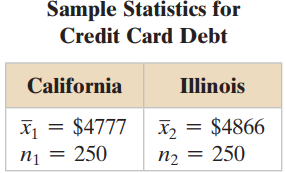

# Hypothesis test concerning TWO population parameters

In order to test difference between two population parameters we need to draw samples from two populations. Using sample statistics and appropriate test statistics we can test whether there is any significant difference between the parameters of interest. In this chapter we will discuss:

1\) testing difference between two population means;

2\) testing difference between two population variances;

3\) testing difference between two means from matched pairs experiment;

4\) testing difference between two population proportions.

## Hypothesis test: Difference between two population means ($\mu_1-\mu_2$)

**Assumptions:**

-   The two samples must be **independent** of each other.

-   The populations from which the samples are drawn should be **normally distributed**, especially when the sample size is small (typically $n<30$).

-   With larger samples, the **Central Limit Theorem** justifies the use of normal approximation even if the population is not normal.

### **Case-I: When** $\sigma_1^2$ **and** $\sigma_2^2$ **are known**

To test $H_0: \mu_1-\mu_2=D_0$ the test statistic is:

$$
z=\frac{(\bar x_1-\bar x_2)-D_0}{s.e(\bar x_1-\bar x_2)}=\frac{(\bar x_1-\bar x_2)-D_0}{\sqrt{\frac{\sigma_1^2}{n_1}+\frac{\sigma^2_2}{n_2}}}
$$ {#eq-z2pops}

The test-statistic **z** follows standard normal distribution. The rejection rule of $H_0$ is same as **one-sample z-test**.

**Problem 11.1** Consider the following information:

|    Sample 1    |    Sample 2    |
|:--------------:|:--------------:|
|    $n_1=80$    |    $n_1=70$    |
| $\bar x_1=104$ | $\bar x_2=106$ |
| $\sigma_1=8.4$ | $\sigma_2=7.6$ |

Now test the following hypothesis:

$$
H_0: \mu_1-\mu_2=0
$$

$$
H_1:\mu_1-\mu_2\ne 0
$$

**Problem 11.2** A credit card watchdog group claims that there is a difference in the mean credit card debts of households in California and Illinois. The results of a random survey of 250 households from each state are shown at the bottom. The two samples are independent. Assume that $\sigma_1 =\$ 1045$ for California and $\sigma_2=\$1350$ for Illinois. Do the results support the group’s claim? Use $\alpha= 0.05$.

{width="149"}

**Problem 11.3** A travel agency claims that the average daily cost of meals and lodging for vacationing in Alaska is greater than the average daily cost in Colorado. The table at the bottom shows the results of a random survey of vacationers in each state. The two samples are independent. Assume that $\sigma_1=\$24$ for Alaska and $\sigma_2=\$19$ for Colorado, and that both populations are normally distributed. At $\alpha= 0.05$, is there enough evidence to support the claim?

### **Case-II(A):** $\sigma_1^2$ **and** $\sigma_2^2$ **are unknown but equal(**$\sigma_1^2=\sigma_2^2$**)**

To test $H_0: \mu_1-\mu_2=D_0$ the test statistic is:

$$
t=\frac{(\bar x_1-\bar x_2)-D_0}{\sqrt {s^2_p(\frac{1}{n_1}+\frac{1}{n_2})}}
$$ {#eq-t2popsequal}

Here, $s^2_p$ **is the pooled variance** and

$$
s^2_p=\frac{(n_1-1)s_1^2+(n_2-1)s_2^2}{n_1+n_2-2}
$$

The test statistic **t** follows the **Student t distribution** with $df=n_1+n_2-2$. The rejection rule of $H_0$ is same as **one-sample t-test**.

### **Case-II(B):** $\sigma_1^2$ **and** $\sigma_2^2$ **are unknown and NOT equal(**$\sigma_1^2 \ne\sigma_2^2$**)**

To test $H_0: \mu_1-\mu_2=D_0$ the test statistic is:

$$
t=\frac{(\bar x_1-\bar x_2)-D_0}{\sqrt{(  \frac{s_1^2}{n_1}+\frac{s^2_2}{n_2}} )}
$$ {#eq-t2popsunequal}

with $df=\frac{(s_1^2/n_1+s_2^2/n_2)^2}{\frac{(s_1^2/n_1)^2}{n_1-1}+\frac{(s_2^2/n_2)^2}{n_2-1} }$

## Testing the Population Variances ($\sigma_1^2=\sigma^2$)

The hypothesis to test the equality of two population variances is:

$$
H_0: \sigma_1^2=\sigma_2^2
$$

$$
H_1: \sigma_1^2\ne\sigma_2^2
$$

**Test statistic**

$$
F=\frac{s_1^2}{s_2^2}
$$ {#eq-Fratio}

The $F$-statistic is $F$-distributed with degrees of freedom $\nu_1=n_1-1$ and $\nu_2=n_2-1$.

Assuming $s_1^2>s_2^2$ ,**we can reject the** $H_0$ **if** $F>F_{\alpha/2, \nu_1,\nu_2}$ ( Here $\alpha/2$ is the area in the upper tail).

**NOTE:** We refer to the population providing the larger sample variance as *population 1* .\

**Problem 11.4** The following data were collected from two population- population A and population B.

|                     | Population A | Population B |
|---------------------|:------------:|:------------:|
| **Sample size**     |      35      |      40      |
| **Sample mean**     |     13.6     |     10.1     |
| **Sample variance** |     5.2      |     8.5      |

*a) Test the equality of variances of the two populations at* $\alpha=5\%$*.*

[Solution (a):]{.underline}

Since the sample variance of population B is greater than that of population A; we consider population B as population 1.

So, $s_1^2=8.5 , s_2^2=5.2$ and $n_1=40; n_2=35$

We have to test the following hypothesis :

$$ H_0: \sigma_1^2=\sigma_2^2   $$

$$ H_1: \sigma_1^2\ne\sigma_2^2 $$

**Test statistic:**

$$
F=\frac{s_1^2}{s_2^2}=\frac{8.5}{5.2}=1.635
$$

**Critical value:** For $\alpha/2=0.025$

$$
F_{0.025,39,34}\approx1.93
$$

**Decision:** Since $F \ngtr F_{\alpha/2}$; so we cannot reject the $H_0$. So the the equality assumption of the two population variances are met.

*b) Then use appropriate test statistic to test equality of two population means at* $\alpha=5\%$*.*

[Solution (b):]{.underline}

We have to test the following hypothesis:

$$
H_0: \mu_1-\mu_2=0
$$

$$
H_1: \mu_1-\mu_2\ne 0
$$

Since equality of population variance is fulfilled so the appropriate **test statistic** is :

$$
t=\frac{(\bar x_1-\bar x_2)}{\sqrt {s^2_p(\frac{1}{n_1}+\frac{1}{n_2})}}
$$

Where, $$
s^2_p=\frac{(n_1-1)s_1^2+(n_2-1)s_2^2}{n_1+n_2-2}=6.963014
$$

So, $t=\frac{10.1-13.6}{\sqrt{6.963014(\frac{1}{40}+\frac{1}{35})}}=-5.731$

**Critical value:** At $\alpha/2=0.025$ , with $df=40+35-2=73$

$-t_{\alpha/2}\approx -1.992$

**Decision:** Since the value of $t$ false in the rejection region (RR) we can reject the $H_0$ .

**Conclusion:** With 95% confidence we can conclude that the population means are not equal; rather mean of population 1 (B) is significantly lower than the mean of population 2 (A).

```{r}
svar1=8.5
svar2=5.2
F_ratio=svar1/svar2

F_c<-qf(.025,40-1,35-1,lower.tail = FALSE)  #F(alpha/2)

#ifelse(F_ratio>F_c,"Reject H0","Do not reject Ho")

svar_pooled<-((40-1)*svar1+(35-1)*svar2)/(40+35-2)

t_sta<-(10.1-13.6)/sqrt(svar_pooled*(1/40+1/35))

t_c<-qt(.025,73)

```

**Problem 11.5** An accounting firm is interested in providing opportunities for its auditors to gain more expertise in statistical sampling methods. They wish to compare traditional classroom instruction with online self-paced tutorials. Auditors were assigned at random to one type of instruction, and the auditors were then given an exam. The table shows how the two groups performed.

{width="175"}

a\) **Test** equality of variances of two methods of learning.

b\) **Test** whether there is any significant difference in mean scores between Traditional and Online method.

## Hypothesis test: Comparing TWO means when the samples are dependent/ matched/paired

The **paired t-test** is used to compare the means of two related groups (e.g., before-and-after measurements on the **same subjects**). To validly apply the test, the following assumptions must be met:

**Assumptions of the Paired t-test:**

1)  [Paired observations:]{.underline} Each subject or entity provides a pair of observations (e.g., pre-treatment and post-treatment). The test assumes that data are dependent.

2)  [Continuous or interval scale:]{.underline} The differences between paired observations should be measured on a continuous (interval or ratio) scale.

3)  [Normality of the differences:]{.underline}

The distribution of the differences (not the raw values) between the paired observations should be approximately normally distributed.

-   For small samples (typically n \< 30), this assumption is critical.

-   For larger samples, the Central Limit Theorem provides robustness.

4)  [No significant outliers in the differences:]{.underline}

Extreme outliers in the differences can heavily influence the result and violate the normality assumption.

**Test procedure**

Suppose $n$ subjects are measured in two different occasion/conditions regarding the measurement variable $X$.

Let, $\mu_A$ be the population mean of $X$ under condition A and

$\mu_B$ be the population mean of $X$under condition B

So the difference between the means is $\mu_d=\mu_A-\mu_B$

To test the **hypotheses:**

$$
H_0: \mu_d=0
$$

$$
H_1: \mu_d \ne 0
$$

the t**est statistic** is:

$$
t=\frac{\bar d -\mu_d}{s_d/ \sqrt{n} }
$$

which is Student t distributed with $n-1$ degrees of freedom, provided that the differences are normally distributed.

The rejection rule is similar as one-sample t-test.\

Here,

-   $n=$ sample size

-   $d_i=$ difference in measurements between two conditions from $i^{th}$ subject

-   $$\bar d=\frac{\sum_{i=1}^{n} d_i}{n}$$

-   $$s_d=\sqrt { \frac{\sum_{i=1}^{n} (d-\bar d)^2}{n-1}}$$

**Problem 11.6**
