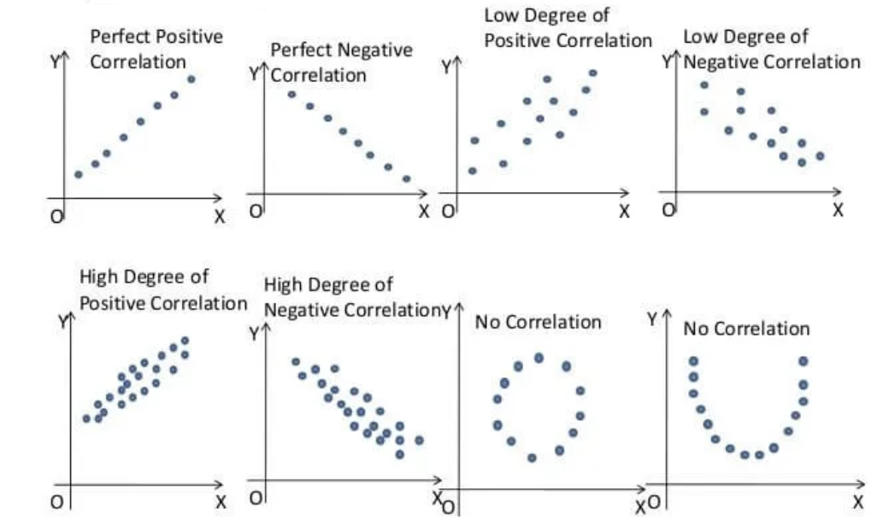

# Correlation and Simple Linear Regression

In real world we often observe that a change in one variable is associated with the change in another variable.

In statistics, **correlation** refers to *degree* and *direction* of **linear relationship** between two quantitative (interval or ratio scale ) variables. For example-

-   As *income* increases *expense* also increases (positive correlation);
-   As *resistance* increases *current flow* decreases (negative correlation) etc.

To understand the nature and to measure the **linear relationship (correlation)** between two quantitative variable we use some techniques. In the following section we will discuss about that.

## Scatter plot: Graphical method to explore correlation

A **scatter plot** shows the relationship between two quantitative variables measured for the same individuals. The values of one variable appear on the horizontal axis, and the values of the other variable appear on the vertical axis. Each individual in the data appears as a point on the graph.

-   A scatterplot *displays* the strength, direction, and form of the relationship between two quantitative variables (*see* @fig-scatter).

{#fig-scatter}

Lets draw a scatter plot for the following data.

```{r}
#| label: tbl-xydata
#| tbl-cap: "Data"
#| tbl-cap-location: top


library(tidyverse)
library(gt)
x=c(2,5,1,3,4,1,5,3,4,2)
y=c(50,57,41,54,54,38,63,48,59,46)
xy=data.frame(x,y)
xy %>%t() %>% as.data.frame()->t.xy
colnames(t.xy)<-1:10
#t.xy %>% gt()
t.xy %>%knitr::kable()
```

```{r fig.height=5,fig.width=5}
#| label: fig-scatterplot
#| fig-cap: "Sctter plot between X and Y"
library(ggthemes)

ggplot(xy,aes(x,y))+
  geom_point()+
  labs(subtitle = "Positive correlation exists between X and Y")+
  theme_light ()+
  theme(plot.background = element_rect(colour = "black"),
        axis.title = element_text(size = 14, face = "bold"),
        axis.text = element_text(size = 12))
  
```

In fact, the scatter lot suggests that a straight line could be used as an approximation of the relationship. In the following discussion, we introduce **covariance, coefficient of correlation, and coefficient of determination** as descriptive measures which provide *direction* and *strength* of the linear relationship between two variables.

## Covariance

The covariance between $X$ and $Y$ is defined as follows

**Population covariance**

$$
\sigma_{XY}=\frac{\sum_{i=1}^N (x_i-\mu_X)(y_i-\mu_Y)}{N}
$$

**Sample covariance**

$$
s_{XY}=\frac{\sum_{i=1}^n (x_i-\bar x)(y_i-\bar y)}{n-1}
$$

**Shortcut for Sample Covariance**

$$
s_{XY}=\frac{\sum xy -n \bar x \bar y }{n-1}
$$ Or,

$$
s_{XY}=\frac{1}{n-1}\left[ \sum xy -\frac{\sum x \sum y}{n}     \right ]   
$$ {#eq-covshort}

**Example:** Compute sample covariance between $X$ and $Y$ from @tbl-xydata.

[**Solution:**]{.underline}

```{r}
#sum(x); sum(y)
#sum(x*y)

```

Here, $n=10 ; \sum x=30 ; \sum y =510$.

$\sum xy =x_1y_1+x_2y_2+ \cdot \cdot \cdot+x_ny_n= 1629$

Hence the sample covariance,

$$
s_{XY}=\frac{1}{n-1} \left[\sum xy - \frac{\sum x \sum y}{n}   \right]
$$

$$
=\frac{1}{10-1} \left[1629 - \frac{30\times 510}{10} \right]
$$

$$
\therefore s_{XY}=11
$$

Since, $s_{XY}>0$ so there exists positive correlation between $X$ and $Y$.

**Drawback of covariance**

According to @keller2014 , "Unfortunately, the magnitude may be difficult to judge. For example, if you’re told that the covariance between two variables is 500, does this mean that there is a strong linear relationship? The answer is that it is impossible to judge without additional statistics. Fortunately, we can improve on the information provided by this statistic by creating another one."

## Coefficient of Correlation

The **Pearson product-moment coefficient of correlation** is defined as the covariance divided by the standard deviations of the variables.

**Population correlation coefficient**

$$
\rho=\frac{\sigma_{XY}}{\sigma_X \times \sigma_Y}\ \ ;\ \ -1\le\rho \le +1
$$

**Sample correlation coefficient**

$$
r=\frac{s_{XY}}{s_X \times s_Y}\ \ ;\ \ -1\le r \le +1
$$ {#eq-sampleR}

Where

$s_{XY}$ is sample covariance between $X$ and $Y$ $s_X$ is sample standard deviation of $X$ and $s_Y$ is sample standard deviation of $Y$.

**Note:** The sample correlation coefficient can be expressed in another form:

$$
r=\frac{n \sum xy-(\sum x) (\sum y)}{\sqrt {\left [n\sum x^2-(\sum x)^2 \right] } \sqrt{\left [n\sum y^2-(\sum y)^2 \right]}}
$$

::: callout-note
## Proof of $-1\le\rho\le+1$

From Cauchy–Schwarz Inequality we know that,

$$
(E[XY])^2\le E[X^2] E[Y^2]
$$

Now center the variables $X$ and $Y$ with respect to their mean we have,

$$
(E[(X-\mu_X)(Y-\mu_Y)])^2 \le E[(X-\mu_X)^2] E[(Y-\mu_Y)^2]
$$

$$
\Rightarrow [Cov(X,Y)]^2 \le Var(X)  \cdot Var(Y)
$$

$$
\Rightarrow (\sigma_{XY})^2 \le \sigma^2_X \sigma^2_Y 
$$

$$
\Rightarrow | \sigma_{XY}| \le \sigma_X \sigma_Y
$$
:::

### Interpretation of correlation coefficient

\(a\) $r=-1$ implies *perfect negative* correlation,

\(b\) $r=+1$ implies *perfect positive* correlation,

\(c\) $r\approx 0$ implies no correlation or very weak correlation,

\(d\) As $r$ close to $-1$ , the degree of *negative* correlation becomes stronger,

\(e\) As $r$ close to $+1$ , the degree of *positive* correlation becomes stronger.

### Computing the Coefficient of Correlation

Let us compute sample correlation coefficient between $X$ and $Y$ from @tbl-xydata.

```{r}
#sum(x); sum(y)
#sum(x*y)
#sum(x^2)
#sum(y^2)

```

Here, $n=10 ; \sum x=30 ; \sum y =510$.

$\sum xy =x_1y_1+x_2y_2+ \cdot \cdot \cdot+x_ny_n= 1629$

$\sum x^2=2^2+5^2 +...+2^2=110$

$\sum y^2=50^2+57^2 +...+46^2=26576$

$\bar x =3$

$\bar y =51$

So,

$$
s_X=\sqrt { \frac{\sum x^2 -n \ \  \bar x^2}{n-1}}=1.490712
$$

$$
s_Y=\sqrt { \frac{\sum y^2 -n \ \ \bar y^2}{n-1}}=7.930252
$$

$$
s_{XY}=\frac{\sum xy -n \ \ \bar x \ \ \bar y }{n-1}=11
$$

```{r}
#$s_X=\sqrt {\frac{1}{n-1} \left[ \sum x^2- \frac{(\sum #x)^2}{n}\right]}$
```

Hence,

$$
r=\frac{s_{XY}}{s_X \times s_Y}=\frac{11}{1.490712\times 7.930252}=0.9305
$$

which is close to 1. So the correlation between $X$ and $Y$ is *strong* and *positive*.

### Exercises: Constructing a Scatter Plot and Determining Correlation

In Exercises 1–4, (a) display the data in a scatter plot, (b) calculate the sample correlation coefficient $r$, and (c) describe the type of correlation and interpret the correlation in the context of the data.

1\. **Age and Blood Pressure.** The ages (in years) of 10 men and their systolic blood pressures (in millimeters of mercury) [@larson2015, 482]

|                                |     |     |     |     |     |     |     |     |     |     |
|--------------------------------|:---:|:---:|:---:|:---:|:---:|:---:|:---:|:---:|:---:|-----|
| **Age, x**                     | 16  | 25  | 39  | 45  | 49  | 64  | 70  | 29  | 57  | 22  |
| **Systolic blood pressure, y** | 109 | 122 | 143 | 132 | 199 | 185 | 199 | 130 | 175 | 118 |

\
2. **Driving Speed and Fuel Efficiency.** A department of transportation’s study on driving speed and miles per gallon for midsize automobiles resulted in the following data [@anderson2020, 149]:

|                            |     |     |     |     |     |     |     |     |     |     |
|----------------------------|:---:|:---:|:---:|:---:|:---:|:---:|:---:|:---:|:---:|:---:|
| **Speed (Miles per Hour)** | 30  | 50  | 40  | 55  | 30  | 25  | 60  | 25  | 50  | 55  |
| **Miles per Gallon**       | 28  | 25  | 25  | 23  | 30  | 32  | 21  | 35  | 26  | 25  |

\
3. Are the marks one receives in a course related to the amount of time spent studying the subject? To analyze this mysterious possibility, a student took a random sample of 10 students who had enrolled in an accounting class last semester. He asked each to report his or her mark in the course and the total number of hours spent studying accounting. These data are listed here [@keller2014].

|                |     |     |     |     |     |     |     |     |     |     |
|----------------|:---:|:---:|:---:|:---:|:---:|:---:|:---:|:---:|:---:|:---:|
| **Study time** | 40  | 42  | 37  | 47  | 25  | 44  | 41  | 48  | 35  | 28  |
| **Marks**      | 77  | 63  | 79  | 86  | 51  | 78  | 83  | 90  | 65  | 47  |

\
4. The owner of a paint store was attempting to analyse the relationship between advertising and sales, and recorded the monthly advertising budget (\$’000) and the sales (\$m) for a sample of 12 months. The data are listed here

|                 |     |     |     |     |     |      |     |      |     |     |      |      |
|-----------------|:---:|:---:|:---:|:---:|:---:|:----:|:---:|:----:|:---:|:---:|:----:|:----:|
| **Advertising** | 23  | 46  | 60  | 54  | 28  |  33  | 25  |  31  | 36  | 88  |  95  |  99  |
| **Sales**       |  8  | 11  | 13  | 13  | 8.9 | 10.7 |  9  | 10.4 | 11  | 14  | 14.4 | 15.9 |

### Coefficient of determination

The coefficient of determination measures the amount of variation in the dependent variable that is explained by the variation in the independent variable.

For example, if $r=0.8764$ between $X$ and $Y$ then **coefficient of determination** $r^2=(0.8764)^2 \approx 0.7681$.

**Interpretation:** The $r^2=0.7681$ tells us that 76.81% variation in $Y$ (dependent variable) can be explained by $X$ (independent variable).\

### Correlation vs. causation

*Correlation* does not always imply *causation*. For example,

-   A study[@messerli2012] found that there was a significant ($r=0.791$) positive correlation between *chocolate consumption per capita* and *number of Nobel laureates per 10 million persons*. This does not necessarily implies that more a country consumes chocolate, more the chance of getting a Nobel prize. Rather differences in socioeconomic status from country to country and geographic and climatic factors may play some role to win a Nobel prize.

-   We might find that there is a positive correlation between the time spent driving on road and the number of accidents but this does not mean that spending more time on road causes accident.Because in that case, in order to avoid accidents one may drive fast so that time spent on road is less [@selvamuthu2024].

### Effect of outlier on correlation coefficient

The correlation coefficient is heavily affected by outlier (see @fig-outlieronr1). It changes the magnitude of the correlation coefficient.

```{r fig.height=5,fig.width=8}
#| label: fig-outlieronr1
#| fig-cap: "Effect of outlier on the magnitude of correlation coefficient (r)"

# Set seed for reproducibility
set.seed(0)

# Generate data with a positive correlation
x <- runif(50, 0, 10)
y <- 2 * x + rnorm(50, 0, 2)  # Linear relationship with some noise

# Calculate correlation without outlier
correlation_without_outlier <- cor(x, y)

# Add an outlier
x_outlier <- c(x, 15)
y_outlier <- c(y, -15)  # Outlier with opposite trend

# Calculate correlation with outlier
correlation_with_outlier <- cor(x_outlier, y_outlier)

# Plot data
par(mfrow=c(1,2))  # Arrange plots side-by-side

# Plot without outlier
plot(x, y, main=paste("Without Outlier\nCorrelation, r =", round(correlation_without_outlier, 2)),
     xlab="X", ylab="Y", col="steelblue", pch=19)
abline(lm(y ~ x), col="red")  # Add line of best fit

# Plot with outlier
plot(x_outlier, y_outlier, main=paste("With Outlier\nCorrelation, r=", round(correlation_with_outlier, 2)),
     xlab="X", ylab="Y", col="steelblue", pch=19)
points(15, -15, col="red", pch=4, cex=2)  # Mark the outlier
abline(lm(y_outlier ~ x_outlier), col="red")  # Add line of best fit

par(mfrow=c(1,1))  # Reset plot layout

```

Even sometime the outlier(s) can change the sign of the correlation coefficient (see @fig-outlieronr2).

```{r fig.height=5,fig.width=8}
#| label: fig-outlieronr2
#| fig-cap: "Effect of outlier on the sign of  correlation coefficient (r)"


# Set seed for reproducibility
set.seed(42)

# Generate data with a positive correlation
x <- runif(50, 0, 10)
y <- -0.5 * x + rnorm(40, 0, 1)  # Negative linear relationship with some noise

# Calculate correlation without the outlier
correlation_without_outlier <- cor(x, y)

# Add an outlier that reverses the correlation direction
x_outlier <- c(x, 50)
y_outlier <- c(y, 10)  # Extreme negative outlier

# Calculate correlation with the outlier
correlation_with_outlier <- cor(x_outlier, y_outlier)

# Plot data
par(mfrow=c(1,2))  # Arrange plots side-by-side

# Plot without outlier

plot(x, y, main=paste("Without Outlier\nCorrelation, r=", round(correlation_without_outlier, 2)),
     xlab="X", ylab="Y", col="#389", pch=19)
abline(lm(y ~ x), col="red")  # Add line of best fit

# Plot with outlier
plot(x_outlier, y_outlier, main=paste("With Outlier\nCorrelation, r=", round(correlation_with_outlier, 2)),
     xlab="X", ylab="Y", col="#389", pch=19)
points(50, 10, col="red", pch=4, cex=2)  # Mark the outlier
abline(lm(y_outlier ~ x_outlier), col="red")  # Add line of best fit

par(mfrow=c(1,1))  # Reset plot layout


```

## Rank correlation

To measure the association between two ordinal or rank-ordered data we use the **Spearman Rank-correlation coefficient (RCC).** Even if in presence of outliers in interval or ratio scale data we can use RCC. The sample Spearman RCC is computed as follows:

$$
r_s=1-\frac{6\sum_{i=1}^n d_i^2}{n(n^2+1)}
$$ {#eq-Rcc}

Where,

$n$ = the number of observations in the sample

$x_i$ = the rank of observation $i$ with respect to the first variable

$y_i$ = the rank of observation $i$ with respect to the second variable

$d_i$ = $x_i-y_i$

The interpretation is as usual as Pearson correlation coefficient.

**Problem 8.4.1** Technology Company Reputations and Investor Willingness to Purchase Stock. A national study by Harris Interactive, Inc., evaluated the top technology companies and their reputations. The following shows how 10 technology companies ranked in reputation and how the companies ranked in percentage of respondents who said they would purchase the company’s stock. A positive rank correlation is anticipated because it seems reasonable to expect that a company with a higher reputation would have the more desirable stock to purchase [@anderson2020a].

| Company           | Reputation | Stock Purchase |
|-------------------|:----------:|:--------------:|
| Microsoft         |     1      |       3        |
| Intel             |     2      |       4        |
| Dell              |     3      |       1        |
| Lucent            |     4      |       2        |
| Texas Instruments |     5      |       9        |
| Cisco Systems     |     6      |       5        |
| Hewlett-Packard   |     7      |       10       |
| IBM               |     8      |       6        |
| Motorola          |     9      |       7        |
| Yahoo             |     10     |       8        |

**Compute** and **interpret** the rank correlation between reputation and stock purchase.

**Problem 8.4.1** Quality of Teaching Assessments. A student organization surveyed both current students and recent graduates to obtain information on the quality of teaching at a particular university. An analysis of the responses provided the following teaching-ability rankings. Do the rankings given by the current students agree with the rankings given by the recent graduates ? [@anderson2020a]\

| Professor | Current Students | Recent Graduates |
|-----------|:----------------:|:----------------:|
| 1         |        4         |        6         |
| 2         |        6         |        8         |
| 3         |        8         |        5         |
| 4         |        3         |        1         |
| 5         |        1         |        2         |
| 6         |        2         |        3         |
| 7         |        5         |        7         |
| 8         |        10        |        9         |
| 9         |        7         |        4         |
| 10        |        9         |        10        |

## Simple linear regression (SLR)

In regression analysis we try to estimate or predict the **outcome/ response** of one variable (dependent variable) on the basis of other variables (independent variable). For example, sales of certain product depends of price, advertising cost, quality of the product, brand etc.

It involves developing a mathematical model or equation that describes the relationship between the **dependent variable** and the **independent variables.**

In the following section we will discuss about the **Simple linear regression (SLR)** where a independent variable and a dependent variable are involved.

### **Population regression function (PRF)**

$$
y_i=\beta_0+\beta_1 x_i+\epsilon_i \hspace{10pt} ; i=1,2,3,..., N
$$ {#eq-PRF}

Where,

$y$= dependent variable

$x$= independent variable

$\beta_0$ =y-intercept

$\beta_1$= slope of the line/ regression coefficient

$\varepsilon$ = error variable

**Assumptions**

i\) The errors are *independently*, *identically* normally distributed with **constant variance** $\sigma_\varepsilon ^2$ that is $\varepsilon_i \overset{\text{i.i.d.}}{\sim} \mathcal{N}(0, \sigma_\epsilon^2)$ .

ii\) The independent variable should not be correlated with the error term (no endogeneity)

Taking conditional expectation of of **PRF** for a given $x_i$ we have

$$
E(y_i/x_i)=\beta_0+\beta_1 x_i 
$$ {#eq-expectedprf}

From sample data we have to estimate $E(y_i/x_i)$ which is equivalent to estimate $\beta_0$ and $\beta_1$.

### Ordinary least square (OLS) estimate of $E(y_i/x_i)$

Let we have $n$ pairs of sample data: $\{X,Y\}=\{ (x_1,y_1), (x_2,y_2),..., (x_n, y_n) \}$. From the sample data suppose the **estimated regression line of** $E(y_i/x_i)$ **is**

$$
\hat y_i= \hat \beta_0+\hat \beta_1 x_i \hspace {10pt}; i=1,2,....,n
$$

So,

$$
y_i=\hat y_i +e_i \hspace{10pt} ; i=1,2, ..., n
$$

Where, $e_i$ is the **estimated error** or **residual.**

Now, the **sum of square of residuals (SSR)** is given as:

$$
SSR=\sum_{i=1}^n e_i^2=\sum_{i=1}^n (y_i-\hat y_i)^2=\sum_{i=1}^n (y_i-\hat \beta_0-\hat \beta_1x_i)^2
$$ {#eq-ssr}

In **OLS** method we *minimize* the **SSR** with respect to $\hat \beta_0$ and $\hat \beta_1$. To minimize **SSR** we have to set two equations using *partial derivative:*

$$
\frac{\delta \hspace{1pt} (SSR)}{\delta \hat \beta_0}=0
$$ {#eq-ols1}

$$
\frac{\delta \hspace{1pt} (SSR)}{\delta \hat \beta_1}=0
$$ {#eq-ols2}

By solving the two equations we will have the **OLS estimates** of $\beta_0$ and $\beta_1$ as follows:

$$
\hat \beta_0=\bar y-\hat \beta_1 \bar x
$$and

$$
\hat \beta_1=\frac{\sum_{i=1}^n (x_i-\bar x)(y_i-\bar y)} {\sum_{i=1}^n (x_i-\bar x)^2}=\frac{s_{xy}}{s^2_x}
$$

Or,

$$
\hat \beta_1=r_{xy} \left (\frac{s_y}{s_x}\right )
$$

Thus, the **estimated regression** line is given by

$$
\hat y_i=\hat \beta_0+\hat \beta_1 x_i
$$

### Point prediction of $y$ for a give $x$

Given $x=x_g$. Then the estimated $y$ for given $x$ is

$$
\hat y_g=\hat \beta _0+\hat \beta_1 \times x_g
$$

### Partition of sum squares

i\) Total sum of square,

$$
SS(Total)=\sum_{i=1}^n (y_i-\bar y)^2=(n-1) s^2_y
$$

ii\) Regression sum of square,

$$
SSR=\sum_{i=1}^n (\hat y_i-\bar y)^2 
$$

In the case of **SLR**, SSR can be written as $$SSR=\hat \beta_1^2\sum_{i=1}^n (x_i-\bar x)^2=\hat \beta_1^2 (n-1)s_y^2$$

iii\) Sum of square of error,

$$
SSE=\sum_{i=1}^n (y_i-\hat y_i)^2=SS(Total)-SSR
$$

### Coefficient of determination (Goodness of fit)

$$
R^2=\frac{SSR}{SS(Total)}  \hspace{10pt}; \hspace{10pt} 0\le R^2\le1 
$$

**Interpretation:** The $R^2$ explains the amount of variation in $Y$ (dependent variable) by the estimated model.

In the case of **SLR,**

$$
R^2=r_{xy}^2=\frac{s^2_{xy}}{s_x^2 \times s^2_y}
$$

### Some problems on SLR

**Problem 10.5.1 :** The owner of a paint store was attempting to analyse the relationship between advertising and sales, and recorded the monthly advertising budget (\$’000) and the sales (\$m) for a sample of 12 months. The data are listed here:

|                 |     |     |     |     |     |      |     |      |     |     |      |      |
|-----------------|:---:|:---:|:---:|:---:|:---:|:----:|:---:|:----:|:---:|:---:|:----:|:----:|
| **Advertising** | 23  | 46  | 60  | 54  | 28  |  33  | 25  |  31  | 36  | 88  |  95  |  99  |
| **Sales**       |  8  | 11  | 13  | 13  | 8.9 | 10.7 |  9  | 10.4 | 11  | 14  | 14.4 | 15.9 |

i\) **Identify** the dependent and independent variable.

ii\) **Plot** the data. Is it appear to be linear?

iii\) Now, **fit**/ **estimate** a linear regression line.

iv\) **Interpret** the regression/slope coefficient.

v\) **Predict** the sales for the advertising cost \$70, 000.

vi\) **Comment** about goodness of fit of the estimated model.

**Problem 10.5.2** **Age and Blood Pressure.** The ages (in years) of 10 men and their systolic blood pressures (in millimeters of mercury).

|                                   |     |     |     |     |     |     |     |     |     |     |
|-----------------------------------|:---:|:---:|:---:|:---:|:---:|:---:|:---:|:---:|:---:|-----|
| **Age**                           | 16  | 25  | 39  | 45  | 49  | 64  | 70  | 29  | 57  | 22  |
| **Systolic blood pressure (SBP)** | 109 | 128 | 143 | 145 | 199 | 185 | 180 | 130 | 175 | 118 |

i\) **Identify** the dependent and independent variable.

ii\) **Plot** the data. Is it appear to be linear?

iii\) Now, **fit**/ **estimate** a linear regression line.

iv\) **Interpret** the regression/slope coefficient.

v\) **Predict** the SBP for the age of a person is 40 years .

vi\) **Comment** about goodness of fit of the estimated model.

[**Solution:**]{.underline}

Let, $Y$=Systolic blood pressure, SBP and $X$ = age (in years)

**i)** Here SBP is dependent variable and age is independent variable

**ii) Scatter plot of Age versus SBP**

```{r}
#| label: fig-slr
#| fig-cap: "Sacter plot of Age and SBP"
#| fig-height: 3
#| fig-width: 4
#| fig-align: left
library(tidyverse)
age<-c(16,25,39,45,49,64,70,29,57,22)
sbp<-c(109,128,143,145,180,185,199,130,175,118)
#length(sbp)
#plot(age,sbp,pch=19)

ggplot(data.frame(age,sbp),aes(age,sbp))+
  geom_point()+geom_smooth(method = "lm",se=FALSE,lwd=0.5)+
  labs(x="Age (in years)", y= "SBP (Hg m)")+
  theme_bw()


```

The scatter plot appears to be linear.

**iii)** Let the estimated regression line is :

$$
\hat y_i=\hat \beta_0 +\hat \beta_1 x_i \hspace{40pt} (1)
$$

From sample data;

$n=10, \sum x =416  , \sum y=1512 , \sum x^2 =20398$,

$\sum y^2=237414, \sum xy=67977$

$\bar x=41.6 , \hspace{10pt} \bar y=151.2$

So,

$$
s_{xy}=\frac{\sum xy-n \cdot \bar x \cdot \bar y}{n-1}=\frac{67977-10\times 41.6\times 151.2}{10-1}=564.2
$$

$$
s^2_x=\frac{\sum x^2 -n\times \bar x^2}{n-1}=343.6
$$

$$
s^2_y=\frac{\sum y^2 -n\times \bar y^2}{n-1}=977.7333
$$

```{r}
sumfun<-function(x,y){
  sumX=sum(x)
  sumY=sum(y)
  sumXY=sum(x*y)
  sumX_sq=sum(x^2)
  sumY_sq=sum(y^2)
  cat( "SumX=",sumX, "\n", "SumY=",sumY,"\n", "SumXY=",sumXY,"\n",
      "SumX_sq=",sumX_sq,"\n", "SumY_sq=",sumY_sq)
}

#sumfun(age,sbp)
#cov(age,sbp)
```

Hence,

$$
\hat \beta_1=\frac{s_{xy}}{s^2_x}=\frac{564.2}{343.6}=1.642026\approx 1.642
$$

and,

$$
\hat \beta_0=\bar y-\hat \beta_1 \bar x=151.2-1.642026\times41.6=82.89172\approx82.8917 
$$

$$
\therefore \hat y_i=82.8917+1.642\hspace{3pt}x_i \hspace{5pt}
$$

iv\) **Interpretation of the regression/slope coefficient:**

Here $\hat \beta_1=1.642$ implies that as one year increases, the SBP will increases by 1.642 Hg m on average.

v\) **Predict the SBP for the age of a person is 40 years:**

For $x=40$ years, the predicted SBP (in Hg m) is

$\hat y_g =82.8917+1.642\times 40=148.5728$ Hg m

vi\) **Comment about goodness of fit of the estimated model:**

The goodness of fit measure is

$$
R^2=\frac{s^2_{xy} }{s^2_x \cdot s^2_y}=\frac{(564.2)^2}{(343.6)(977.7333)}=0.9475
$$

Hence, $R^2=0.9475$ implies that 94.75% variation in "SBP" can be explained by the estimated model.
