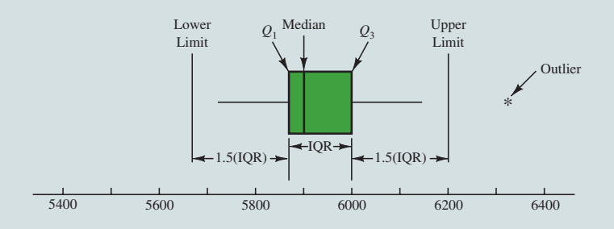
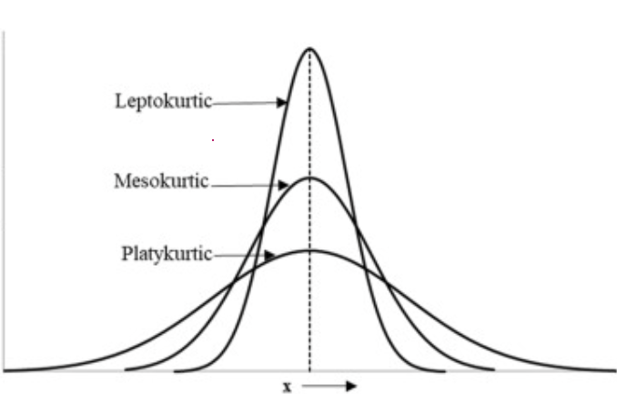

# Descriptive statistics: Numerical Measures

Numerical measures of location, dispersion, shape, and association are introduced. If the measures are computed for data from a sample, they are called **sample statistics**. If the measures are computed for data from a population, they are called **population parameters**.In statistical inference, a sample statistic is referred to as the **point estimator** of the corresponding population parameter[@anderson2011].

## Measures of location

In statistics, measures of location, also known as measures of central tendency, are used to describe the central value or position of a distribution. They provide information about where the “center” of the distribution lies. Common measures of location include:

**a) Mean b) Median c) Mode d) Percentiles e) Quartiles**

### Mean

-   **Sample mean:** Suppose $n$ observation of a variable $X$ is drawn from a population. Then the sample mean is denoted by $\bar x$ and

$$
\bar x =\frac{\sum x}{n}
$$

The sample mean $\bar x$ is a sample statistic.

-   **Population mean:** Suppose in a population there are $N$ values of variable $X$. Then the population mean is denoted by $\mu$ and

$$
\mu =\frac{\sum x}{N}
$$

The $\bar x$ is a point estimator of the population mean $\mu$.

### Weighted mean

The weighted mean is a special case of the arithmetic mean. It occurs when there are several observations of the same value.

-   **Weighted mean:**

$$
\bar x=\frac{\sum w_i x_i}{\sum w_i}
$$

where, $w_i=$ weight for observation $i$

**Example 3.1** [@lind2012]**:** The Carter Construction Company pays its hourly employees \$16.50, \$19.00, or \$25.00 per hour. There are 26 hourly employees, 14 of which are paid at the \$16.50 rate, 10 at the \$19.00 rate, and 2 at the \$25.00 rate. What is the mean hourly rate paid the 26 employees?

[Solution:]{.underline}

```{r}
xi<-c(16.50,19.00,25.00)
wi=c(14,10,2)

#sum(xi*wi)

```

| Hourly wage (\$), x~i~ | Weight (w~i~ ) | $w_ix_i$ |
|:----------------------:|:--------------:|:--------:|
|         16.50          |       14       |   231    |
|         19.00          |       10       |   190    |
|         25.00          |       2        |    50    |

Here, $\sum w_ix_i=471$ and $\sum w_i=26$

Hence, $\bar x=\frac{\sum w_i x_i}{\sum w_i}=\frac{471}{26}=18.1154$

So, the weighted mean hourly wage is rounded to \$18.12.

**Example 3.2** [@anderson2020] **:** The grade point average for college students is based on a weighted mean computation. For most colleges, the grades are given the following data values: A (4), B (3), C (2), D (1), and F (0). After 60 credit hours of course work, a student at State University earned 9 credit hours of A, 15 credit hours of B, 33 credit hours of C, and 3 credit hours of D.

a\. Compute the student’s grade point average.

b\. Students at State University must maintain a 2.5 grade point average for their first 60 credit hours of course work in order to be admitted to the business college. Will this student be admitted?\

**Example 3.3** [@lind2012]**:** Springers sold 95 Antonelli men’s suits for the regular price of \$400. For the spring sale, the suits were reduced to \$200 and 126 were sold. At the final clearance, the price was reduced to \$100 and the remaining 79 suits were sold.

\(a\) What was the weighted mean price of an Antonelli suit?

\(b\) Springers paid \$200 a suit for the 300 suits. Comment on the store’s profit per suit if a salesperson receives a \$25 commission for each one sold.

[***Ans:***]{.underline} (a) \$237 (b) \$12

### Median

The **median** is another measure of central location. The median is the value in the middle when the data are arranged in ascending order (smallest value to largest value).

-   For an *odd* number of observations, median is the middle value

-   For an *even* number of observations, median is the average of the two middle values

**Example 3.4 (n is odd):** Let us consider the following class size data for a sample of five college classes.

46, 54, 42, 46, 32

**Arranged data:** 32, 42, [**46,**]{.underline} 46, 54.

Because $n=5$ is odd, the median is the middle value. Thus the median class size is **46** students.

**Example 3.5 (n is even):** Let us consider the following class size data for a sample of five college classes.

46, 54, 42, 46, 32, 40

**Arranged data:** 32, 40, [**42**]{.underline}, [**46,**]{.underline} 46, 54.

Because $n=6$ is even, the

$$
Median=\frac{42+46}{2}=44
$$

::: callout-note
Although the mean is the more commonly used measure of central location, in some situations the median is preferred. For example, the median is the measure of location most often reported for annual income and property value data because a few extremely large incomes or property values can inflate the mean. In such cases, the median is the preferred measure of central location.
:::

### Mode

The **mode** is the value that occurs with greatest frequency.

::: callout-note
Situations can arise for which the greatest frequency occurs at two or more different values. In these instances, more than one mode exists. If the data contain exactly two modes, we say that the data are **bimodal**. If data contain more than two modes, we say that the data are multimodal. In **multimodal** cases the mode is almost never reported because listing three or more modes would not be particularly helpful in describing a location for the data.
:::

### Percentiles

A **percentile** provides information about how the data are spread over the interval from the smallest value to the largest value.

-   The $p^{th}$ percentile is a value such that *at least* $p$ percent of the observations are less than or equal to this value and *at least* $(100-p)$ percent of the observations are greater than or equal to this value.

-   **Formula:**

$$
p^{th} \  \ percentile=( p\times \frac{n+1}{100} )^{th} \ \ value 
$$

**Example 3.6:** Here is the monthly starting salary (\$) of 12 graduates:

3450 ,3550 ,3650 ,3480 ,3355, 3310 ,3490 ,3730, 3540 ,3925, 3520 ,3480

Let us determine the 85^th^ percentile for the starting salary data.

[Solution:]{.underline}

**Arranged data:** 3310, 3355, 3450, 3480, 3480, 3490, 3520, 3540, 3550, 3650, 3730, 3925

Now,

$$
L_{85}=( 85\times \frac{12+1}{100} )^{th} \ \ value 
$$

$$
=11.05^{th} \ \ value =11^{th} \ \ value+0.05 (12^{th} -11^{th})
$$ $$
=3730+0.05(3925-3730)
$$

$$
=3739.75 \ \ dollars
$$

[Interpretation:]{.underline} Here, $85^{th} \ \ percentile =3739.75$ implies that at least 85% of the total observations (salaries ) are less or equal to 3739.75 dollars.

### Quartiles

It is often desirable to divide data into four parts, with each part containing approximately one-fourth, or 25% of the observations. The division points are referred to as the quartiles and are defined as

*Q~1~* = first quartile, or 25^th^ percentile

*Q*~2~ = second quartile, or 50^th^ percentile (also the median)

*Q*~3~ = third quartile, or 75^th^ percentile.

**Example 3.7:** Here is the monthly starting salary (\$) of 12 graduates:

3450, 3550, 3650, 3480, 3355, 3310, 3490, 3730, 3540, 3925, 3520, 3480

Compute Q1 and Q3 of the above data (*Will be solved in class*).

### Geometric mean

The **geometric mean** is useful in finding the average change of percentages, ratios, indexes, or growth rates over time. It has a wide application in business and economics because we are often interested in finding the percentage changes in sales, salaries, or economic figures, such as the Gross Domestic Product, which compound or build on each other.

-   **Geometric mean (GM):** GM is the $n^{th}$ root of the product of $n$ values.

$$
GM=\sqrt[n]{(x_1)(x_2) \cdot \cdot \cdot (x_n)}=[(x_1)(x_2) \cdot \cdot \cdot(x_n)]^{1/n}
$$

**Example 3.8:** Compute the geometric mean of the following percent increases: 8, 12, 14, 26, and 5.

[Solution:]{.underline} Here, $n=5$. The geometric mean is:

$$
GM=[8\cdot12\cdot14\cdot26\cdot5]^{1/5}=[174720]^{1/5}\approx 11.18
$$

**Exercise 3.9** [@lind2012]**:** The percent increase in sales for the last 4 years at Combs Cosmetics were: 4.91,5.75, 8.12, and 21.60.

(a) Find the geometric mean percent increase.

(b) Find the arithmetic mean percent increase.

(c) Is the arithmetic mean equal to or greater than the geometric mean?

**Example 3.10:** Listed below is the percent increase in sales for the MG Corporation over the last 5 years. **Determine** the geometric mean percent increase in sales over the period.

9.4, 13.8, 11.7, 11.9, 14.7

## Measures of variability

Variability in data means lack of uniformity. It is also referred to as spread, scatter, or dispersion. We turn now to a discussion of some commonly used measures of variability.

### Range

$Range =$ **Largest value** $-$ **Smallest value**

-   The simplest one, but is highly influenced by extreme values.

### Interquartile Range (IQR)

$$IQR=Q_3-Q_1$$

-   The interquartile range is the range for the middle 50% of the data.

### Variance

The variance is a measure of variability that utilizes all the data. The variance is based on the difference between the value of each observation ($x_i$) and the mean. The difference between each $x_i$ and the mean ($\bar x$ for a sample, $\mu$ for a population) is called a deviation about the mean.

-   **Population variance**

$$
\sigma^2 =\frac{(x_1-\mu)^2+(x_2-\mu)^2+\cdot \cdot \cdot+(x_N-\mu)^2}{N} = \frac{\sum (x_i -\mu)^2}{N}
$$

-   **Sample variance**

$$
s^2=\frac{(x_1-\bar x)^2+(x_2-\bar x)^2+ \cdot \cdot \cdot+(x_n-\bar x)^2}{n-1} = \frac{\sum (x_i -\bar x)^2}{n-1}
$$

> *The sample variance* $s^2$ *is the estimator of the population variance* $\sigma^2$ .

-   An alternative formula for the computation of the sample variance is:

$$
s^2=\frac{\sum x_i^2-n\bar x^2}{n-1}
$$ where, $\sum x_i^2=x_1^2+x_2^2+...+x_n^2$

::: callout-note
## Derivation

Since, $\bar x=\frac{\sum x}{n}$ so, $\sum x=n\cdot \bar x$

Now, $\sum_{i=1}^n (x_i-\bar x)^2$

$=\sum_{i=1}^n(x_i^2-2 \cdot x_i \cdot \bar x+\bar x^2)$

$=\sum_{i=1}^n x_i^2-2\bar x \sum_{i=1}^n x_i+\sum_{i=1}^n \bar x^2$

$=\sum_{i=1}^n x_i^2 -2\bar x\cdot n\bar x+n\bar x^2$

$=\sum_{i=1}^n x_i^2 -2n\bar x^2+n\bar x^2=\sum_{i=1}^n x_i^2-n\bar x^2$
:::

**Example 3.11:** Here is the monthly starting salary (\$) of 6 graduates:

3450 ,3550 ,3650 ,3480 ,3355, 3545.

**Compute** sample variance ($s^2$).

[Solution:]{.underline}

Here, **sample size,** $n=6$.

The sample mean salary,

$\bar x =\frac{\sum x}{n}=\frac{3450+\cdot \cdot \cdot+3545}{6}=3505 \ \ dollars$

```{r}

library(tidyverse)

sal<-c(3450 ,3550 ,3650 ,3480 ,3355, 3310 ,3490 ,3730, 3540 ,3925, 3520 ,3480)

sal6<-c(3450 ,3550 ,3650 ,3480 ,3355, 3545)
#mean(sal6)

sal6d=as.data.frame(sal6)

sal6d %>% mutate(m=mean(sal6),deviation=sal6-m,squared_deviation=deviation^2)->varcaltable 

#sum(varcaltable$squared_deviation)

#varcaltable %>% knitr::kable()

```

| Salary ($x_i$) | Sample mean, $\bar x$ | $(x_i-\bar x)$ | $(x_i-\bar x)^2$ |
|:--:|:--:|:--:|:--:|
| 3450 | 3505 | -55 | 3025 |
| 3550 | 3505 | 45 | 2025 |
| 3650 | 3505 | 145 | 21025 |
| 3480 | 3505 | -25 | 625 |
| 3355 | 3505 | -150 | 22500 |
| 3545 | 3505 | 40 | 1600 |
|  |  | $\sum (x_i-\bar x ) =0$ | $\sum (x_i-\bar x )^2 =50800$ |

: Computation of the sample variance for the starting Salary data {#tbl-tbl3.1}

Hence, the sample variance is:

$$
s^2=\frac{\sum (x_i-\bar x)^2}{n-1}=\frac{50800}{6-1}=10160 \ \ (dollars)^2 
$$

### Standard deviation

The **standard deviation** is defined to be the positive square root of the variance

-   **Sample standard deviation=**$s=\sqrt s^2$

-   **Population standard deviation=**$\sigma =\sqrt \sigma ^2$

> *The sample standard deviation* $s$ *is the estimator of population standard deviation* $\sigma$*.*

**Example 3.12:** The standard deviation of the previous example is :

$$
s=\sqrt {10160} =100.7968\approx 100.80 \ \ dollars
$$

::: callout-note
## Note:

The standard deviation is easier to interpret than the variance because the standard deviation is measured in the same units as the data.
:::

For example, the sample variance for the starting salary data of business school graduates is $s^2=10160 \ \ (dollars)^2$.

Because the standard deviation is the square root of the variance, the units of the variance, dollars squared, are converted to dollars in the standard deviation.

Thus, the standard deviation of the starting salary data is 100.80 dollar. In other words, the standard deviation is measured in the same units as the original data. For this reason the standard deviation is more easily compared to the mean and other statistics that are measured in the same units as the original data.

::: callout-note
## Properties of variance

1.  **Non-negativity:** $Var(X)\ge 0$.

2.  For any constant say $X=c$ , $Var(c)=0$.

3.  Variance is affected by outliers.

4.  Variance is NOT affected by **change origin**; but affected by **change of scale** that is:

    $Var(aX+b)=a^2 Var(X)$

    Here, $a$ and $b$ are both constants.

**Proof:** For a population data $X=\{ x_1,x_2,..., x_N\}$ the population mean of $X$ is

$\mu_X =\frac{\sum_{i=1}^N x_i}{N}$ and variance of $X$ is

$Var(X)=\frac{\sum_{i=1}^N (x_i-\mu_X)^2}{N}$

Now let, $Y=aX+b$

So, the population mean of $Y$ is

$\mu_Y=\frac{\sum_{i=1}^N y_i}{N}=\frac{\sum_{i=1}^N (a x_i+b)}{N}$

$=\frac{\sum_{i=1}^N (ax_i)+\sum_{i=1}^N b} {N}=a\frac{\sum_{i=1}^N x_i}{N}+\frac{Nb}{N}=a \cdot\mu_X+b$

Hence,

$$
Var(Y)=\frac{\sum_{i=1}^N (y_i-\mu_Y)^2}{N}=\frac{\sum_{i=1}^N(a\cdot x_i+b-a\cdot \mu_X-b)^2}{N}
$$

$$
=\frac{\sum_{i=1}^N (a\cdot x_i -a\cdot \mu_X)^2}{N}
$$

$$
a^2 \frac{\sum_{i=1}^N (x_i-\mu_X)^2}{N}=a^2 Var(X)
$$

$\therefore Var(Y)= Var(aX+b)=a^2 Var(X)$.
:::

### Coefficient of variation (CV)

In some situations we may be interested in a descriptive statistic that indicates how large the standard deviation is relative to the mean. This measure is called the **coefficient of variation** and is usually expressed as a percentage.

**Coefficient variation,**

$$
CV=\frac{Standard \ \ deviation}{Mean}
$$

-   The coefficient of variation is a relative measure of variability; it measures the standard deviation relative to the mean.

-   In general, the coefficient of variation is a useful statistic for comparing the variability of variables that have different standard deviations and different means.

**Example 3.13:** The table at the left shows the population heights (in inches) and weights (in pounds) of the members of a basketball team. Find the coefficient of variation for the heights and the weights. Then compare the results.

::: panel-tabset
#### Data

| **Heights (inches)** | **Weights (pounds)** |
|:--------------------:|:--------------------:|
|          72          |         180          |
|          74          |         168          |
|          68          |         225          |
|          76          |         201          |
|          74          |         189          |
|          69          |         192          |
|          72          |         197          |
|          79          |         162          |
|          70          |         174          |
|          69          |         171          |
|          77          |         185          |
|          73          |         210          |

#### Coefficient of variation

The mean height $\mu =\frac{\sum x}{N}=\frac{72+74+\cdot \cdot \cdot+ 73}{12}  \approx 72.8 \ \ inches$ with a standard deviation $\sigma =\sqrt {\frac{\sum x^2}{N}-\mu^2} =3.3 \ \ inches$.

The coefficient of variation for the heights is\
$CV_{height}=\frac{\sigma}{\mu}.100\%=\frac{3.3}{72.8} . 100\% \approx 4.5\%$.

Similarly,

the mean weight $\mu \approx 187.8 \ \ pounds$ with a standard deviation $\sigma =17.7 \ \ pounds$.

The coefficient of variation for the weights is

$CV_{weight}=\frac{\sigma}{\mu}.100\%=\frac{17.7}{187.8}.100\% \approx9.4\%$

***Interpretation:*** The weights (9.4%) are more variable than the heights (4.5%).
:::

## The mean and standard deviation of Grouped data

In most cases, measures of location and variability are computed by using the individual data values. Sometimes, however, data are available only in a grouped or frequency distribution form. In the following discussion, we show how the weighted mean formula can be used to obtain approximations of the mean, variance, and standard deviation for **grouped data**.

### Sample mean for grouped data

$$
\bar x=\frac{\sum f_i M_i}{n}
$$ where,

$M_i=\frac{Lower \ \ limit+Upper\ \ limit}{2}=$ the midpoint for class $i$

$f_i=$ the frequency for class $i$

$n=$ the sample size $=\sum f_i$

### Sample variance for grouped data

$$
s^2=\frac{\sum f_i(M_i-\bar x)^2}{n-1}=\frac{\sum M_i x_i^2-n\cdot \bar x^2}{n-1}
$$

Eventually the **standard deviation** is $\sqrt {s^2}$

**Example 3.14** The frequency distribution of audit times is given below:

| Audit Time (days) | Frequency |
|:-----------------:|:---------:|
|       10-14       |     4     |
|       15-19       |     8     |
|       20-24       |     5     |
|       25-29       |     2     |
|       30-34       |     1     |
|       Total       |    20     |

: Frequency distribution of audit times

**Compute** sample mean and standard deviation of Audit time (days) from the above frequency distribution / grouped data.

[*Solution:*]{.underline}

|  |  |  |  |  |
|----|:--:|:--:|:--:|:--:|
| **Audit Time (days)** | **Mid point**$(M_i)$ | **Frequency** $(f_i)$ | $f_i M_i$ | $f_i M_i^2$ |
| 10-14 | 12 | 4 | 48 | 576 |
| 15-19 | 17 | 8 | 136 | 2312 |
| 20-24 | 22 | 5 | 110 | 2420 |
| 25-29 | 27 | 2 | 54 | 1458 |
| 30-34 | 32 | 1 | 32 | 1024 |
| **Total** |  | **20** | **380** | **7790** |

: Computation of the sample mean audit time for grouped data

**Sample mean,**

$$
\bar x=\frac{\sum f_i M_i}{n}=\frac{380}{20}=19 \ \ days
$$

**Sample variance,**

$$
s^2=\frac{\sum f_i M_i^2-n\cdot \bar x^2}{n-1}=\frac{7790-20\cdot19^2}{20-1}=30 \ \ (days)^2
$$

Hence the **standard deviation is:**

$s=\sqrt {30} \ \ days =5.48 \ \ days$

```{r}
M=seq(12,32,5)
f=c(4,8,5,2,1)

#sum(M*f)
#sum((M^2)*f)
```

## Measures of relative location: z-score

In addition to measures of location, variability, and shape, we are also interested in the relative location of values within a data set. Measures of relative location help us determine how *far a particular value* is from the **mean.**

### z-score

The **z-score** provide how far an observation or value is from the mean or average.

::: {.callout-note icon="false"}
## z-score

Let, $X=\{x_1,x_2,...,x_n\}$ has the *sample mean* $\bar x$ and the *sample standard deviation* $s$. Then the **z-score** for $x_i$ is :

$$
z_i=\frac{x_i-\bar x}{s}
$$
:::

-   The z-score is often called the *standardized value*. The z-score, $z_i$, can be interpreted as the *number of standard deviations* $x_i$ is from the mean $\bar x$. For example, $z_1 = 1.2$ would indicate that $x_1$ is 1.2 standard deviations greater than the sample mean. Similarly, $z_2 = -0.5$ would indicate that $x_2$ is 0.5, or 1/2, standard deviation less than the sample mean.

-   A z-score greater than zero occurs for observations with a value greater than the mean, and a z-score less than zero occurs for observations with a value less than the mean. A z-score of zero indicates that the value of the observation is equal to the mean.

-   The z-score for any observation can be interpreted as a measure of the relative location of the observation in a data set. Thus, observations in two different data sets with the same z-score can be said to have the same relative location in terms of being the same number of standard deviations from the mean.

**Example 3.15** Suppose $X=\{46,54,42,46,32\}$. Here $X$ is the number students in each class.

i\) Compute *sample mean* and *standard deviation* of $X$

ii\) Compute *z-scores*

iii\) Interpret the *z-scores* for 54 and 32

iv\) Compute the mean and variance of *z-scores*

**Example 3.16** Consider a very large number of students taking a college entrance exam such as the SAT. And suppose the mean score on the mathematics section of the SAT is 570 with a standard deviation of 40.

a\) Find the z-score for a student who scored 600.

b\) A student is told that his z-score on this test is -1.5. What was his actual SAT math score?

### Chebyshev’s Theorem

Regardless of the shape of a distribution **Chebyshev’s Theorem** provides lower bound of proportion of observations lie within a certain interval.

::: callout-note
**Chebyshev’s Theorem**

At least $(1 - \frac{1}{z^2})$ of the data values must be within $z$ standard deviations of the mean, where $z>1$.

*Mathematically,*

$P(\bar x-z\cdot s<X<\bar x+z\cdot s)\ge (1-\frac{1}{z^2})$
:::

**Example 3.16** Suppose that the midterm test scores for 100 students in a college business statistics course had a mean of 70 and a standard deviation of 5.

i\) How many students (in %) had test scores between 60 and 80?

ii\) How many students (in %) had test scores between 58 and 82?

[Solution:]{.underline}

Here, $\bar x=70; \ \ s=5$

i\) For $x=60\ \ ; z=\frac{60-70}{5}=-2$

For, $x=80\ \ ; z=\frac{80-70}{5}=+2$

Applying Chebyshev’s theorem with $z = 2$, we have

$$
(1-\frac{1}{z^2})=(1-\frac{1}{2^2})=0.75
$$ So, at least 75% of the students must have test scores between 60 and 80.

ii\) DIY

**Example 3.16** Suppose that the midterm test scores for 100 students in a college business statistics course had a mean of 70 and a standard deviation of 5. **Find** the interval in which at least 80% data values lie.

### Empirical Rule

If a **distribution is approximately bell-shaped/symmetric/normal** then

-   Approximately 68% of the data values will be within **one** standard deviation of the mean.

-   Approximately 95% of the data values will be within **two** standard deviations of the mean.

-   Almost all of the data values (99%) will be within **three** standard deviations of the mean.

### Detecting Outliers

Sometimes a data set will have one or more observations with unusually large or unusually small values. These extreme values are called **outliers**.

::: callout-note
## Using z-score to detect outlier

An observation say $x_i$ is treated as *outlier* if its corresponding **z-score** is *less than -3* or *greater than +3*.

**Equivalently**, if an observation $x_i$ falls outside the interval $[\bar x-3\cdot s,\bar x+3\cdot s]$.
:::

::: callout-note
## Using 1.5(IQR) rule to detect outlier

We define two limits as follows:

Lower limits, $LL=Q_1-1.5 (IQR)$

Upper limits, $UL=Q_3+1.5 (IQR)$

Any data value or observation falls outside the interval $[LL,UL]$ will be treated as outlier.
:::

## Five-Number summary

In a **five-number summary**, five numbers are used to summarize the data:

1\. Smallest value

2\. First quartile (Q1)

3\. Median (Q2)

4\. Third quartile (Q3)

5\. Largest value\

## Box-plot

The **box plot** is a graphical display that simultaneously describes several important features of a data set, such as **center**, **spread**, a **departure from symmetry**, and identification of unusual observations or **outliers**.

A key to the development of a boxplot is the computation of the interquartile range, $IQR = Q_3 - Q_1$. @fig-boxplot shows a boxplot for the monthly starting salary data. The steps used to construct the boxplot follow [@anderson2020a].

{#fig-boxplot}

**Salary data (assenting order)**

5710, 5755, 5850, 5880, 5880, 5890, 5920, 5940, 5950, 6050, 6130, 6325

1\. A box is drawn with the ends of the box located at the first and third quartiles. For the salary data, $Q_1 = 5857.5$ and $Q_2 = 6025$. This box contains the middle 50% of the data.

2\. A vertical line is drawn in the box at the location of the **median** (5905 for the salary data).

3\. By using the interquartile range, $IQR = Q_3 - Q_1$, *limits* are located at $1.5(IQR)$ below $Q1$ and $1.5(IQR)$ above $Q3$. For the salary data, $IQR = Q3 - Q1 = 6025 – 5857.5 = 167.5$. Thus, the *limits* are $LL=5857.5 – 1.5(167.5) = 5606.25$ and $UL=6025 + 1.5(167.5) = 6276.25$. Data outside these limits are considered outliers.

4\. The horizontal lines extending from each end of the box in @fig-boxplot called *whiskers*. The whiskers are drawn from the ends of the box to the smallest and largest values *inside* the *limits* computed in step 3. Thus, the whiskers end at salary values of 5710 and 6130.\

Here is the computer generated boxplot of salary data using R programmning language [@R].

```{r}
salary_d<-c(5710, 5755, 5850, 5880, 5880, 5890, 5920, 5940, 5950, 6050, 6130, 6325)

boxplot(salary_d,horizontal = T,pch=19,lwd=1,col = "#B6C5D1", main="Boxplot of the Monthly Starting Salary  Data" ,xlab="Salary (in US dollars)")
```

### Boxplot and skewness of the data

When we discuss the frequency histogram we also learned about shape of the distribution. By visual inspection of boxplot we can also tell about the distribution shape of a variable. The following boxplots are the typycal examples of skewness of the data.

```{r}
library(tidyverse)
library(ggthemes)

set.seed(1)
x=rbeta(200,2,2)+50

#boxplot(x,horizontal = T,xlab="Value",main="(a) Boxplot of approximately symmetric distribution")

y=rbeta(200,1,2)+50

#boxplot(y,horizontal = T,xlab="Value",main="(b) Boxplot of positively skewed distribution",cex.main=0.9)

z=rbeta(200,4,2)+50

#boxplot(z,horizontal = T,xlab="Value",main="(c) Boxplot of negatively skewed distribution",cex.main=0.9)


xyz<-tibble(x,y,z)

box_theme<-theme_classic()+
  theme(axis.text = element_blank(),
        axis.ticks = element_blank(),
        axis.title = element_blank())


b1<-ggplot(xyz,aes(x))+
  geom_boxplot(fill="cyan3")+
  labs(title = "Symmetric (approximately)")+box_theme
  
b2<-ggplot(xyz,aes(y))+
  geom_boxplot(fill="cyan3")+
  labs(title = "Positively skewed")+box_theme
  

b3<-ggplot(xyz,aes(z))+
  geom_boxplot(fill="cyan3")+
  labs(title = "Negatively skewed")+box_theme
  
library(patchwork)
(b1/b2/b3)

xyz %>% gather(key = "variable",value = "value")->xyz.long

xyz.long %>% 
  ggplot(aes(x = variable, y = value)) +  # Add x here!
  geom_boxplot(fill = "steelblue") +
  facet_wrap(~variable, nrow = 3) +
  coord_flip()+
  labs(x="")+
  theme_bw()+
  theme(axis.text.y = element_blank(),
        axis.ticks = element_blank())->b123


```

**Example 3.17** [@anderson2020, 158]**:** **Household Incomes**. The following data represent a sample of 14 household incomes(\$1000s). Answer the following questions based on this sample.

```         
49.4 52.4 53.4 51.3 52.1 48.7 52.1

52.2 64.5 51.6 46.5 52.9 52.5 51.2
```

a.  What is the median household income for these sample data?

b.  According to a previous survey, the median annual household income five years ago was \$55,000. Based on the sample data above, estimate the percentage change in the median household income from five years ago to today.

c.  Compute the first and third quartiles.

d.  Provide a five-number summary.

e.  Using the z-score approach, do the data contain any outliers? Does the approach that uses the values of the first and third quartiles and the interquartile range to detect outliers provide the same results?

### Comparative box-plot

**An example:** Cell Phone Companies Customer Satisfaction. Consumer Reports provides overall customer satisfaction scores for AT&T, Sprint, T-Mobile, and Verizon cell-phone services in major metropolitan areas throughout the United States. The **rating** for each service reflects the overall customer satisfaction considering a variety of factors such as cost, connectivity problems, dropped calls, static interference, and customer support. A satisfaction scale from 0 to 100 is used with 0 indicating completely dissatisfied and 100 indicating completely satisfied. Suppose that the ratings for the four cell-phone services in 20 metropolitan areas are as shown below [@anderson2020].

| Metropolitan Area | AT&T | Sprint | T-Mobile | Verizon |
|-------------------|:----:|:------:|:--------:|:-------:|
| Atlanta           |  70  |   66   |    71    |   79    |
| Boston            |  69  |   64   |    74    |   76    |
| Chicago           |  71  |   65   |    70    |   77    |
| Dallas            |  75  |   65   |    74    |   78    |
| Denver            |  71  |   67   |    73    |   77    |
| Detroit           |  73  |   65   |    77    |   79    |
| Jacksonville      |  73  |   64   |    75    |   81    |
| Las Vegas         |  72  |   68   |    74    |   81    |
| Los Angeles       |  66  |   65   |    68    |   78    |
| Miami             |  68  |   69   |    73    |   80    |
| Minneapolis       |  68  |   66   |    75    |   77    |
| Philadelphia      |  72  |   66   |    71    |   78    |
| Phoenix           |  68  |   66   |    76    |   81    |
| San Antonio       |  75  |   65   |    75    |   80    |
| San Diego         |  69  |   68   |    72    |   79    |
| San Francisco     |  66  |   69   |    73    |   75    |
| Seattle           |  68  |   67   |    74    |   77    |
| St. Louis         |  74  |   66   |    74    |   79    |
| Tampa             |  73  |   63   |    73    |   79    |
| Washington        |  72  |   68   |    71    |   76    |

: Cell Phone Companies Customer Satisfaction {#tbl-tab.compare}

We can easily compare the **ratings** for 4- cell-phone services using **comparative/parallel box-plots**

```{r}
#| label: fig-parabox
#| fig-cap: "Comparative Boxplots of Rating by customer for cell-phone services"
#| fig-align: center


library(readxl)
library(tidyverse)
Rating<- read_excel("StatForBandE_data.xlsx", 
    sheet = "Sheet5")

Rating %>% ggplot(aes(x=Company,y=Rating))+
  geom_boxplot(fill="steelblue")+
  theme_bw()+
  theme(axis.text = element_text(size = 12,color = "black"),
        axis.title =element_text(size = 14,face = "bold") )+
  labs(title = " ")


```

-   Now, **discuss** what a comparison of the boxplots tells about the four services.

-   Which service does *Consumer Reports* recommend as being best in terms of overall customer satisfaction?\

## Measures of shape: Skewness and Kurtosis

**Measures of shape** are tools that can be used to describe the shape of a distribution of data. In this section, we examine two measures of shape, **skewness** and **kurtosis**.

### Skewness

Skewness refers to lack of symmetry or departure from symmetry. There are three types of skewness based on the histogram or density plot of data.

a\) **Positive skewness**/ Skewed right- where *mean\>median\>mode*

b\) **Symmetrical distribution**- in a perfect symmetrical distribution *mean=median=mode*

c\) **Negative skewness**/ Skewed left- where *mean\<median\<mode*

The typical example of skewness is exhibited in @fig-skewness with the relative position of mean, median and mode.

{#fig-skewness fig-align="center" width="516"}

```{r}
set.seed(1)

skewR<-5+rbeta(10000,2,8)*20
mean.sk=mean(skewR)
median.sk=median(skewR)

#hist(skewR,freq = F,col = "white")
#lines(density(skewR),lwd=2)
#abline(v=mean.sk,col="red",lwd=2)
#abline(v=median.sk,col="green",lwd=2)
#arrows(x0 = mean.sk, y0 = 0.15,x1 = mean.sk, y1 = 0)
```

### Kurtosis

**Kurtosis** *describes the amount of peakedness of a distribution*.

-   Distributions that are high and thin are referred to as **leptokurtic** distributions.

-   Distributions that are flat and spread out are referred to as **platykurtic** distributions.

-   Between these two types are distributions that are more “normal” in shape, referred to as **mesokurtic** distributions.

These three types of kurtosis are illustrated in @fig-kurtosis.

{#fig-kurtosis width="416"}

### Measures of skewness and kurtosis using Moments

**Moments:**

Suppose a sample of size $n$ of variable $X$ with observations $x_1,x_2,....,x_n$.

The$r^{th}$sample **raw moment is**

$$
m'_{r}=\frac{\sum_{i=1}^{n} x_i^r}{n}
$$ {#eq-rawm}

Hence the first 4 raw moments are:

$m'_1=\frac{\sum_{i=i}^n x_i}{n}=\bar x$

$m'_2=\frac{\sum_{i=i}^n x_i^2}{n}$

$m'_3=\frac{\sum_{i=i}^n x_i^3}{n}$

$m'_4=\frac{\sum_{i=i}^n x_i^4}{n}$

The$r^{th}$sample **central moment (about mean) is:**

$$
m_r=\frac{\sum_{i=1}^n (x_i-\bar x)^r}{n}
$$ {#eq-centralm}

Hence the first 4 central moments are:

$m_1=\frac{\sum(x-\bar x)}{n}=\frac{0}{n}=0$

$m_2=\frac{\sum(x-\bar x)^2}{n}$

$m_3=\frac{\sum(x-\bar x)^3}{n}$

$m_4=\frac{\sum(x-\bar x)^4}{n}$

**Relation between raw moments and central moments**

a\) $m_1=0$

b\) $m_2=m'_2-{m'_1}^2$

c\) $m_3=m'_3-3m'_1 m'_2+2{m'_1}^3$

d\) $m_4=m'_4-4m'_1 m'_3+6{m'_1}^2 m'_2-3{m'_1}^4$

**Example 3.18**

**Calculate** the first 4 central moments from the following sample data.

`3,5,6,9,12`

[Solution:]{.underline}

```{r}

moments<-function(x,r){
  x_bar=mean(x)
  n=length(x)
  mr=numeric(r)
  for (i in 1:r) {
    mr[i]=sum((x-x_bar)^i)/n
    #print(mr[i])
  }
  return(mr)
}

x=c(3,5,6,9,12)

#moments(x,4)


```

Here sample mean, $\bar x=\frac{\sum x}{n}=\frac{3+5+...+12}{5}=7$

| $x$ | $(x-\bar x)$ | $(x-\bar x)^2$ | $(x-\bar x)^3$ | $(x-\bar x)^4$ |
|:--:|:--:|:--:|:--:|:--:|
| 3 | -4 | 16 | -64 | 256 |
| 5 | -2 | 4 | -8 | 16 |
| 6 | -1 | 1 | -1 | 1 |
| 9 | 2 | 4 | 8 | 16 |
| 12 | 5 | 25 | 125 | 625 |
| $\sum x=35$ | $\sum (x-\bar x)=0$ | $\sum(x-\bar x)^2=50$ | $\sum(x-\bar x)^3=60$ | $\sum (x-\bar x)^4=914$ |

The central moments are:

$m_1=0$

$m_2=\frac{50}{5}=10$

$m_3=\frac{60}{5}=12$

$m_4=\frac{914}{5}=182.8$

**Coefficient of skewness and kurtosis based on moments**

The **coefficient skewness** say $\gamma_1$ is defined as

$$
\gamma_1=\frac{m_3}{\sqrt {m_2 ^3}}
$$

[**Decision:**]{.underline}

a\) $\gamma_1>0$ indicates positive skewness;

b\) $\gamma_1 \approx 0$ indicates symmetrical distribution;

c\) $\gamma_1 <0$ indicates negative skewness.

The **coefficient of kurtosis** say $\beta_2$ is defined as:

$$
\beta _2=\frac{m_4}{m_2^2}
$$

[**Decision:**]{.underline}

a\) $\beta_2>3$ indicates *leptokurtic* distribution*;*

b\) $\beta_2 \approx 3$ indicates *mesokurtic/normal* distribution*;*

c\) $\beta_2<3$ indicates *platykurtic* distribution*.*

**Example 3.18 (continued)**

From the calculated moments in **Example 3.18** now we compute coefficients of skewness and kurtosis.

Now,

$$
\gamma_1=\frac{m_3}{\sqrt {m_2 ^3}}=\frac{12}{\sqrt{ 10^3}}=0.38>0
$$

So the distribution is **positively skewed**.

Again,

$$
\beta _2=\frac{m_4}{m_2^2}=\frac{182}{10^2}=1.82<3
$$

So the distribution is **platykurtic**.

**NOTE:**

Some authors [@newbold2013] use the following formulas to measure skewness and kurtosis without mentioning the moments.

$$
Skewness = \frac{1}{n} \left[ \sum \left( \frac{X_i - \overline{X}}{s} \right)^3 \right]=\frac{1}{n} \sum  z_i^3 
$$

For calculation purpose the above formula is written as

$$
Skewness=\frac{1}{n}\frac{\sum (X-\bar X)^3}{s^3}
$$

and

$$
Kurtosis = \frac{1}{n} \left[ \sum \left( \frac{X_i - \overline{X}}{s} \right)^4 \right]=\frac{1}{n} \sum  z_i^4 
$$

For calculation purpose the above formula is written as

$$ Kurtosis=\frac{1}{n}\frac{\sum (X-\bar X)^4}{s^4} $$

**There are some other formulas to calculate skewness:**

1\) Coefficient of skewness, $S_k=\frac{mean-mode}{SD}$

2\) $S_k=\frac{3(mean-median)}{SD}$

3\) $S_k=\frac{Q_3+Q_1-2 Median}{Q_3-Q_1}$

**Example 3.19** A sample of five data entry clerks employed in the Harry County Tax Office revised the following *number of tax records* last hour: 100, 75, 70, 65, and 50.

**Comment** about *skewness* and *kurtosis* of the *number of tax records*.

**Home work**

1\) **Compute** coefficient of *skewness* and *kurtosis* and comment for the following data : 20,21,5,9,14,6,19,16.

2\) Suppose the following data are the ages of Internet users obtained from a sample.

41, 15 ,31, 25 ,24, 23 ,21 ,22 ,22 ,18, 30 ,20 ,19 ,19 ,16, 23 ,27 ,38 ,34 ,24, 19 ,20, 29 ,17, 23.

```{r}
library(moments)

skurt<-c(41, 15 ,31, 25 ,24, 23 ,21 ,22 ,22 ,18, 30 ,20 ,19 ,19 ,16, 23 ,27 ,38 ,34 ,24, 19 ,20, 29 ,17, 23)

#smean<-mean(skurt)
#hist(skurt)
#skewness(skurt)
#kurtosis(skurt)+3
#sum((skurt-smean)^2)/(length(skurt)-1)
#var(skurt)

#sum((skurt-smean)^2)
#sum((skurt-smean)^3)
#sum((skurt-smean)^4)
```

From sample data we have following statistics: $\sum(X-\bar X)^2=1062$, $\sum(X-\bar X)^3=7020$ and $\sum(X-\bar X)^4=153198$.

a\) **Plot** a histogram. What is your observation about skewness? Is it possible to have an idea about form the histogram?

b\) Now compute the coefficient of skewness and kurtosis of the given data and comment.

c\) Does your observation in part (a) match with the result in part (b)?

```{r}
#| code-fold: true

hist(skurt,xlab = "Age of users (in year)",main="")
```

## Exercise

**3.1** What are the common measures of central tendency/ location?

**3.2** When median is preferable to mean?

**3.3** Discuss the nature of unimodal, bimodal and multimodal data/ distribution.

**3.4** What are the common measures of dispersion/ variation?

**3.5** (a) Compute the mean of the following sample values: 5, 9, 4, 10 (b) Show that $\sum (x-\bar x)=0$.

**3.6** (a) Compute the mean of the following sample values: 1.3, 7.0, 3.6, 4.1, 5.0 (b) Show that $\sum (x-\bar x)=0$.

**3.7** Show that variance is affected by change of scale; but not by origin.

**3.8** The monthly starting salary (\$) of 12 graduates:

> 3450 ,3550 ,3650 ,3480 ,3355, 3310 ,3490 ,3730, 3540 ,3925, 3520 ,3480

i)  **Compute** sample mean and standard deviation.

ii) **Compute** sample median and IQR.

iii) To be in top 10% earners what should be the starting salary of a graduate?

**3.9 Automobile Fuel Efficiencies.** In automobile mileage and gasoline-consumption testing, 13 automobiles were road tested for 300 miles in both city and highway driving conditions. The following data were recorded for miles-per-gallon performance.

> ***City:*** 16.2, 16.7, 15.9, 14.4, 13.2, 15.3, 16.8, 16.0, 16.1, 15.3, 15.2, 15.3, 16.2
>
> ***Highway:*** 19.4, 20.6, 18.3, 18.6, 19.2, 17.4, 17.2, 18.6, 19.0, 21.1, 19.4, 18.5, 18.7

Use the mean, median, and mode to make a statement about the difference in performance for city and highway driving.

**3.10 Air Quality Index.** The Los Angeles Times regularly reports the air quality index for various areas of Southern California. A sample of air quality index values for Pomona provided the following data: 28, 42, 58, 48, 45, 55, 60, 49, and 50.

i\) Compute the range and interquartile range.

ii\) Compute the sample variance and sample standard deviation.

iii\) A sample of air quality index readings for Anaheim provided a sample mean of 48.5, a sample variance of 136, and a sample standard deviation of 11.66. What comparisons can you make between the air quality in Pomona and that in Anaheim on the basis of these descriptive statistics?

\
**3.11** **Reliability of Delivery Service.** The following data were the number of days required to fill orders for Dawson Supply, Inc., and J.C. Clark Distributors.

> *Dawson Supply Days for Delivery:* 11, 10, 9, 10, 11, 11, 10, 11, 10, 10
>
> *Clark Distributors Days for Delivery:* 8, 10, 13, 7, 10, 11, 10, 7, 15, 12

Which company is more *consistent* to fill orders?

**Hints:** Compute and compare standard deviation (SD) of the number days for each company. The less SD would indicate more consistency.

**3.12** **Amateur Golfer Scores.** Scores turned in by an amateur golfer at the Bonita Fairways Golf Course in Bonita Springs, Florida, during 2017 and 2018 are as follows:

> *2017 Season:* 74, 78, 79, 77, 75, 73, 75, 77
>
> *2018 Season:* 71, 70, 75, 77, 85, 80, 71, 79

i\) Use the mean and standard deviation to evaluate the golfer’s performance over the two-year period.

ii\) What is the primary difference in performance between 2017 and 2018? What improvement, if any, can be seen in the 2018 scores?

**3.13** **Consistency of Running Times.** The following times were recorded by the quarter-mile and mile runners of a university track team (times are in minutes).

> *Quarter-Mile Times:* 0.92, 0.98, 1.04, 0.90, 0.99
>
> *Mile Times:* 4.52, 4.35, 4.60, 4.70, 4.50

After viewing this sample of running times, one of the coaches commented that the quarter-milers turned in the more consistent times.

i\) Use the standard deviation and the coefficient of variation to summarize the variability in the data.

ii\) Does the use of the coefficient of variation indicate that the coach’s statement should be qualified?\

**3.14** Automobiles traveling on a road with a posted speed limit of 55 miles per hour are checked for speed by a state police radar system. Following is a frequency distribution of speeds.\

|                            |               |
|:--------------------------:|:-------------:|
| **Speed (miles per hour)** | **Frequency** |
|           45-49            |      10       |
|           50-54            |      40       |
|           55-59            |      150      |
|           60-64            |      175      |
|           65-69            |      75       |
|           70-74            |      15       |
|           75-79            |      10       |
|         **Total**          |    **475**    |

i\) What is the *mean speed* of the automobiles traveling on this road?

ii\) **Compute** the *variance* and the *standard deviation*.\

**3.15** Consider a sample with a mean of 500 and a standard deviation of 100. What are the z-scores for the following data values: 520, 650, 500, 450, and 280?

**3.16** Consider a sample with a mean of 30 and a standard deviation of 5. Use Chebyshev’s theorem to determine the percentage of the data within each of the following ranges:

a.  20 to 40

b.  15 to 45

**3.17** The results of a national survey showed that on average, adults sleep 6.9 hours per night. Suppose that the standard deviation is 1.2 hours.

a.  Use Chebyshev’s theorem to calculate the percentage of individuals who sleep between 4.5 and 9.3 hours.

b.  Use Chebyshev’s theorem to calculate the percentage of individuals who sleep between 3.9 and 9.9 hours.

c.  Assume that the number of hours of sleep follows a bell-shaped distribution. Use the empirical rule to calculate the percentage of individuals who sleep between 4.5 and 9.3 hours per day. How does this result compare to the value that you obtained using Chebyshev’s theorem in part (a)?

**3.18** The high costs in the California real estate market have caused families who cannot afford tobuy bigger homes to consider backyard sheds as an alternative form of housing expansion. Many are using the backyard structures for home offices, art studios, and hobby areas as well as for additional storage. The mean price of a customized wooden, shingled backyard structure is \$3100 (Newsweek, September 29, 2003). Assume that the standard deviation is \$1200. a. What is the z-score for a backyard structure costing \$2300?

b.  What is the z-score for a backyard structure costing \$4900?

c.  Interpret the z-scores in parts (a) and (b). Comment on whether either should be considered an outlier.

d.  The Newsweek article described a backyard shed-office combination built in Albany, California, for \$13,000. Should this structure be considered an outlier? Explain.

**3.19** Consider a sample with data values of 27, 25, 20, 15, 30, 34, 28, and 25. Provide the five-number summary for the data. Also construct a boxplot.

**3.20** A data set has a first quartile of 42 and a third quartile of 50. Compute the lower and upper limits for the corresponding box plot. Should a data value of 65 be considered an outlier?\

**3.21** A sample of 28 time shares in the Orlando, Florida, area revealed the following daily charges (in USD dollars) for a one-bedroom suite. For convenience, the data are ordered from smallest to largest.

116, 121, 157, 192, 207, 209, 209, 229, 232, 236, 236, 239, 243, 246,

260,264, 276, 281, 283, 289, 296, 307, 309, 312, 317, 324, 341, 353

a\) Compute the lower and upper limits and check for outlier(s).

b\) Then construct a boxplot of the daily charges and show the outlier(s) if any in the boxplot.

c\) Comment on the distribution of the daily charges.\

**3.22** Suppose a consumer group asked 18 consumers to keep a yearly log of their shopping practices and that the following data represent the number of coupons used by each consumer over the yearly period.

::: panel-tabset
## Data

81, 68, 70, 100, 94, 47, 66, 70, 82, 110, 105, 60, 21, 70, 66, 90, 78, 85\

## Ordered data

```{r}
three20<-c( 81, 68, 70, 100, 94, 47, 66, 70, 82, 110, 105,60, 21, 70, 66, 90, 78, 85)

#sort(three20)


```

21, 47, 60, 66, 66, 68, 70, 70, 70, 78, 81, 82, 85, 90, 94, 100, 105, 110
:::

a\) Use the data to construct a box-and-whisker plot.

b\) Discuss the skewness of the distribution of these data and point out any outliers.\

\
