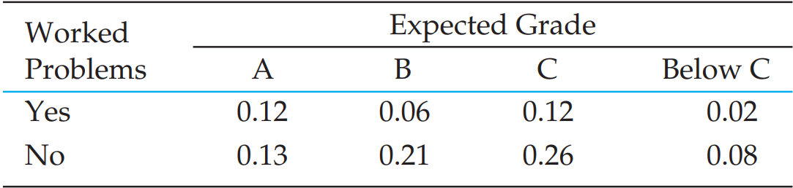
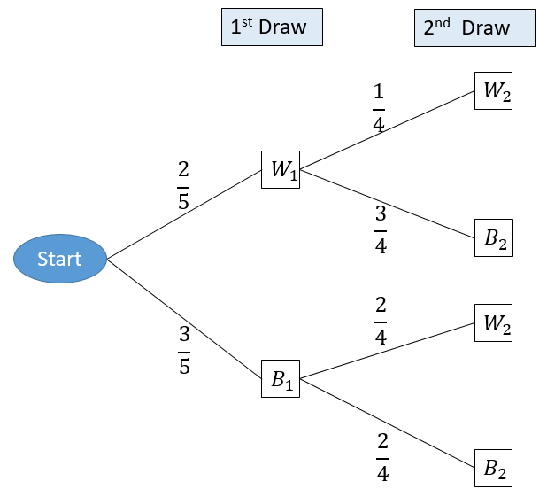
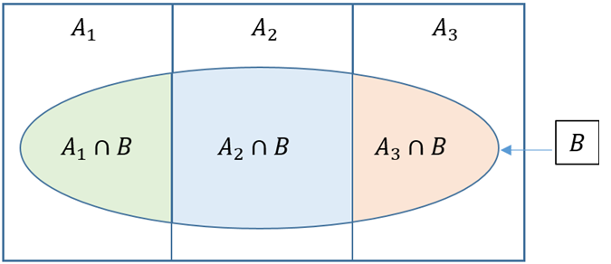

# Probability

A probability is the chance, or likelihood, that a particular event will occur. These are examples of events representing typical probability-type questions:

-   How many customers will arrive in a super shop in next 30 minutes?

-   What is probability that a stock price will rise or fall?

To answer these kind of questions in the face of uncertainty we need to study probability. To answer these type of questions which are raised in real life; at first we have to learn some basic concepts of probability.

## Random experiment

A **random experiment** is a process leading to two or more possible outcomes, without knowing exactly which outcome will occur [@newbold2013].

**Example 4.1:** Tossing a coin, throwing a dice, change in the stock prices etc.

## Sample space

A **sample space** is the collection of all outcomes of a random experiment. The sample space is usually denoted by $S$ or Greek letter $\Omega$ (omega).

**Example 4.2:**

-   If we toss a coin then the sample space is: $S=\{H,T\}$

-   If we toss 2 coins then the sample space is: $S=\{HH,HT,TH,TT\}$

## Event

An **event** is a *subset* of a *sample space*.

For example suppose, $S=\{HH,HT,TH,TT\}$ and $A=\{HH,TT\}$ is an event which a subset of sample space $S$.

## Complement of an event

The complement of an event A with respect to Ω is the subset of all elements of $\Omega$ that are not in A. We denote the complement of A by the symbol $A^C$.

**Example 4.3:** Consider the sample space:

$\Omega =\{ 1,2,3,4,5,6\}$

Let, $A=\{1,3,5 \}$. Then the complement of $A$ is $A^C=\Omega-A=\{2,4,6\}$

## Mutually exclusive events

The occurrence of one event means that none of the other events can occur at the same time.

**Example 4.4:**

-   The variable “Employment status” presents mutually exclusive outcomes, *employed* and *unemployed*. An employee selected at random is either male or female but cannot be both.

-   A manufactured part is acceptable or unacceptable. The part cannot be both acceptable and unacceptable at the same time.

## Collectively Exhaustive

Given the $K$ events $E_1$, $E_2$, . . . , $E_K$ in the sample space, $S$, if $E_1 \cup E_2 \cup . . . \cup E_K = S$, these $K$ events are said to be collectively exhaustive.

## Axiomatic definition of Probability

The **probability** of an event $A$ is the sum of the weights of all sample points in $A$. Therefore,

\(a\) $0 \le P(A)\le 1$

\(b\) If $A_1, A_2,A_3,...$ is a sequence of mutually exclusive events, then

$$ P(A_1\cup A_2 \cup  A_3\cup ...).=P(A_1)+P(A_2)+P(A_3)+... $$

\(c\) $P(\Omega)=1$

## Probability of an event (Classical approach)

Suppose an event $A$ is defined in the sample space $S$. Then the probability of event $A$ is defined as :

$$
P(A)=\frac{n(A)}{n(S)};
$$

Here,

$n(A)=$ number of outcomes favorable to event $A$;

$n(S)=$ total number of outcomes in the sample space $S$.

**Example 4.5** Consider a random experiment of throwing two six-sided fair dices. Then the sample space is:

|           | **Dice2** |       |       |       |       |       |
|-----------|:---------:|:-----:|:-----:|:-----:|:-----:|:-----:|
| **Dice1** |   (1,1)   | (1,2) | (1,3) | (1,4) | (1,5) | (1,6) |
|           |   (2,1)   | (2,2) | (2,3) | (2,4) | (2,5) | (2,6) |
|           |   (3,1)   | (3,2) | (3,3) | (3,4) | (3,5) | (3,6) |
|           |   (4,1)   | (4,2) | (4,3) | (4,4) | (4,5) | (4,6) |
|           |   (5,1)   | (5,2) | (5,3) | (5,4) | (5,5) | (5,6) |
|           |   (6,1)   | (6,2) | (6,3) | (6,4) | (6,5) | (6,6) |

Now **compute** the following probabilities:

a\) probability of same number in both dices;

b\) probability that sum of the numbers of two dices are equal to 5.

[Solution:]{.underline} Here $n(\Omega)=36$

a\) Let, $A$={same number in both dices}={(1,1),(2,2),(3,3),(4,4),(5,5),(6,6)}.

Hence, $n(A)=6$. So, $P(A)=\frac{n(A))}{n(\Omega)}=\frac{6}{36}=\frac{1}{6}$.

b\) DIY (do it yourself).

**Example 4.6** A box/ an urn contains 6 black balls and 4 white balls. If two balls are selected at random (at a time) what is the probability that the

i\) both balls will be black?

ii\) both balls will be white?

[Solution-i)]{.underline} Here, 2 balls can be selected in total ${10\choose 2}=45$ ways. So, $n(\Omega)=45$.

Suppose, $B$={2 black balls selected}. Two black balls can be selected in ${6\choose 2}=15$ ways. So, $n(B)=15$.

$\therefore P(B)=\frac{n(B)}{n(\Omega)}=\frac{15}{45}=\frac{1}{3}$.

[Solution-i)]{.underline} DIY.

## Probability of an event (Empirical approach)

**Empirical Probability** is a type of probability that is calculated based on actual observations, experiments, or historical data rather than theoretical assumptions. It measures the likelihood of an event occurring by analyzing past occurrences or experimental results.

**Formula for Empirical Probability:**

$$
P(E)=\frac{Number\ \ of  \ \ times \ \ the\ \  event\ \  occurs}{Total \ \ number\ \  of \ \ trials}
$$

Where:

-   $P(E)$ is the probability of the event $E$,

-   The numerator is the count of occurrences of the event, and

-   The denominator is the total number of trials or observations.

**Example 4.7:** Suppose in a class there are 30 students; 20 are male and 10 are females. If a student is selected at random what is the probability that he is a male?

[Solution:]{.underline} Let, $E_1=$ set of male students and $E_2=$ set of female students. And, $S=$ set of all students

So, probability that a male student is selected is: $$
P(E_1)=\frac{n(E_1)}{n(S)}=\frac{20}{30}=0.66667\approx 0.67
$$ *Interpretation* There is almost $67\%$ chance that the selected student will be male.

## Properties of Probability Laws

Probability laws have a number of properties, which can be deduced from the axioms. Some of them are summarized below.

a\) $P(A^C)=1-P(A)$ **\[complement rule\]**

b\) $P(A \cap B^C )=P(A)-P(A \cap B)$ **\[only A happens\]**

c\) $P(A \cup B)=P(A)+P(B)-P(A \cap B)$ **\[additive rule\]**

d\) $P(A^C \cap B^C )=P(A∪B)^C=1-P(A \cup B)$. **\[neither A NOR B happens\]**

e\) $P(only \ \ A \  \ \ or \ \ only \ \ B)=P(A \cap B^C)+P(A^C\cap B)$

$=P(A)+P(B)-2 P(A\cap B)$

**Example 4.8:** In a class 65% students prefer tea and 35% students prefer coffee. While 15% students prefer both tea and coffee. If a student is selected at random from the class **find** the probability that

i)  he/she prefers only coffee

ii) he/she prefers tea or coffee

iii) he/she prefers none (neither tea nor coffee)

**Example 4.9** [@lind2012, page 166]A local bank reports that 80 percent of its customers maintain a checking account, 60 percent have a savings account, and 50 percent have both. If a customer is chosen at random, what is the probability the customer has either a checking or a savings account? What is the probability the customer does not have either a checking or a savings account?

**Example 4.10** [@lind2012, page 166]All Seasons Plumbing has two service trucks that frequently need repair. If the probability the first truck is available is .75, the probability the second truck is available is .50, and the probability that both trucks are available is .30, what is the probability neither truck is available?

## Conditional Probability

The conditional probability of an event $A$, *given* an event $B$ with $P(B) > 0$, is defined by,

$$
P(A|B)=\frac{P(A\cap B)}{P(B)}=\frac{n(A\cap B)}{n(B)}
$$ **Example 4.11** The probability that a regularly scheduled flight departs on time is $P(D) = 0.83$; the probability that it arrives on time is $P(A) = 0.82$; and the probability that it departs and arrives on time is $P(D \cap A) = 0.78$. Find the probability that a plane:

(a) arrives on time, given that it departed on time, and

(b) departed on time, given that it has arrived on time.

## The Multiplication Rule

The multiplication rule is used to calculate the joint probability of two events.

The joint probability of any two events A and B is

$$ P(A\cap B)=P(B). P(A|B) \ \ [Considering \ \ B \ \ as \ \ prior] $$

or, altering the notation,

$$ P(A\cap B)=P(A). P(B|A) \ \ [Considering \ \ A \ \ as \ \ prior] $$

**Example 4.12:** Suppose a box contains 10 balls; 4 are black and 6 are white. If 2 balls are drawn at random successively without replacement , what is the probability that both balls are white?

[Solution:]{.underline}

Let, W~1~= 1st ball is white ; W~2~=2nd ball is also white.

According to question, $$ P(both \ \ balls \ \ are \ \ white)=P(W_1\cap W_2)=P(W_1).P(W_2|W_1) $$

$$ =\frac{6}{10}.\frac{5}{9}=\frac{1}{3} $$

**Example 4.13** Suppose $P(A)=0.40$ and $P(B|A)=0.30$. What is the joint probability of $A$ and $B$ ?

**Example 4.14** Suppose $P(X_1)=0.75$ and $P(Y_2|X_1)=0.30$. What is the joint probability of $X_1$ and $Y_2$ ?

## Independent events

If two events A and B are independent, the probability that both of them occur is equal to the product of their individual probabilities i.e.

$$ P(A\cap B)=P(A) P(B) $$

-   **Corollary:** If A and B are independent events then their complement events also be independent that is,

$$ P(A^C\cap B^C)=P(A^C) P(B^C) $$

-   **Independence Rule for Multiple events:**

$$ P(A\cap B \cap C )=P(A) P(B) P(C)  $$

**Example 4.15** [@lind2012, page 182] You take a trip by air that involves three independent flights. If there is an 80 percent chance each specific leg of the trip is done on time, what is the probability all three flights arrive on time?

**Example 4.16** [@lind2012, page 182] The probability a HP network server is down is .05. If you have three independent servers, what is the probability that at least one of them is operational?

[Solution:]{.underline}

Given, $P(server \ \ is \ \ down)=0.05$.

So, $P(server \  \ is \ \ operational)=0.95$

Now, let $O_i=\{ i^{th} \ \ server \ \ is \ \ operational\}$

So,

$P(at \ \ least \ \ one\ \  of\ \  them\ \   is \  \ operational)$

$=P(O_1 \cup O_2 \cup O_3)=1-P(O_1^C \cap O_2^C \cap O_3^C)$

$=1-P(O_1^C) \cdot P(O_2^C) \cdot P(O_3^C)$

$=1-(0.05)(0.05)(0.05)=0.9999875$.

**Example 4.17** [@lind2012, page 182] Twenty-two percent of all liquid crystal displays (LCDs) are manufactured by Samsung. What is the probability that in a collection of three independent LCD purchases, at least one is a Samsung?

## Bivariate Probabilities: Joint and Marginal Probability

The **Intersection** of events $A$ and $B$ is the event that occurs when both A and B occur.

It is denoted as A and B or $(A\cap B)$.

The probability of the intersection is called the joint probability that is $P(A\cap B)$.

**Example 4.18:** Suppose that our sample space $S$ is the population of $900$ adults in a small town who have completed the requirements for a college degree. We shall categorize them according to gender and employment status. The data are given in @tbl-table1 (also referred as *joint frequency table or cross-table*)

|            | Employed | Unemployed |
|------------|:--------:|:----------:|
| **Male**   |   460    |     40     |
| **Female** |   140    |    260     |

: Categorization of the Adults in a Small Town {#tbl-table1}

**Question i:** Construct a joint probability table

[Solution i:]{.underline} Let,

$A_1=$ Male adults

$A_2=$ Female adults

$B_1=$ Employed adults

$B_2=$ Unemployed adults

Here $n(S)=900$. Now divide all cell frequency by $900$ and round to 2 decimal points, hence we get joint probability table below(see @tbl-table4):

|          | B~1~ | B~2~ |
|----------|:----:|:----:|
| **A~1~** | 0.51 | 0.04 |
| **A~2~** | 0.16 | 0.29 |

: Joint probability table {#tbl-table4}

**Joint probability:** In @tbl-table4 the joint probabilities are:

i)  $P(A_1\cap B_1)=0.51$

ii) $P(A_1 \cap B_2)=0.04$

iii) $P(A_2\cap B_1)=0.16$ and

iv) $P(A_2\cap B_2)=0.29$

**Marginal probability:** In @tbl-table4 the marginal probabilities are:

i)  $P(A_1)=0.51+0.04=0.55$

ii) $P(A_2)=0.16+0.29=0.45$

iii) $P(B_1)=0.51+0.16=0.67$

iv) $P(B_2)=0.04+0.29=0.33$

From a joint probability table we cab also compute **conditional probabilities**. For example,

$P(A_1|B_1)=\frac{P(A_1\cap B_1)}{P(B_1)}=\frac{0.51}{0.67}\approx 0.7612$

## Independent Events in Joint probability table

Let $A$ and $B$ be a pair of events, each broken into mutually exclusive and collectively exhaustive event categories denoted by labels $A_1$, $A_2$, . . . , $A_H$ and $B_1$,$B_2$, . . . , $B_K$. If every event $A_i$ is statistically independent of every event $B_j$, then $A$ and $B$ are independent events [@newbold2013].

**Example 4.19** Students in a business statistics class were asked what grade they expected in the course and whether they worked on additional problems beyond those assigned by the instructor. The following table gives proportions of students in each of eight joint classifications [@newbold2013, exercise 3.68].

{fig-align="center" width="399"}

a.  **Find** the probability that a randomly chosen student from this class worked on additional problems.

b.  **Find** the probability that a randomly chosen student from this class expects an A.

c.  **Find** the probability that a randomly chosen student expects an A given that he/she worked on additional problems .

d.  **Find** the probability that a randomly chosen student worked on additional problems given that he/she expects an A .

e.  Are "worked additional problems" and "expected grade" statistically independent?

[Solution:]{.underline}

Let, Y={Yes} and N={No}.

The joint probability table with marginal probability table is given below:

|                  |  **A**   |  **B**   |  **C**   | **D (Below C)** | **Row total** |
|:----------:|:----------:|:----------:|:----------:|:----------:|:----------:|
|      **Y**       |   0.12   |   0.06   |   0.12   |      0.02       |   **0.32**    |
|      **N**       |   0.13   |   0.21   |   0.26   |      0.08       |   **0.68**    |
| **Column total** | **0.25** | **0.27** | **0.38** |    **0.10**     |   **1.00**    |

[Solution of (e):]{.underline} To show whether "worked additional problems" and "expected grade" statistically independent we have to verify whether "Y, N" and "A", "B", "C" are independent events.

Now from joint probability table, $P(Y\cap A)=0.12$.

And $P(Y\cap A)=P(Y)\cdot P(A)=0.32\times 0.25=0.08$.

Since $P(Y\cap A) \ne P(Y) \cdot P(A)$ so, $Y$ and $A$ are not independent. Hence, we do not need to test other combinations.

In conclusion we can say that "worked additional problems" and "expected grade" are not statistically independent.

## Exercises 4.1

4.1) [@anderson2011] Suppose that we have two events, A and B, with $P(A)= 0.50$, $P(B) = 0.60$, and $P(A \cap B) = 0.40$ .

i)  Find $P(A | B)$.

ii) Find $P(B | A)$.

iii) Are A and B independent? Why or why not?

4.2) Suppose P(A)=0.40 and P(B\|A)=0.30. What is the joint probability of A and B?

4.3) A local bank reports that 80 percent of its customers maintain a checking account, 60 percent have a savings account, and 50 percent have both. If a customer is chosen at random, what is the probability the customer has either a checking or a savings account? What is the probability the customer does not have either a checking or a savings account?

4.4) [@keller2014] Suppose we have the following joint probabilities .

|          |          |          |          |
|----------|:--------:|:--------:|:--------:|
|          | **A~1~** | **A~2~** | **A~3~** |
| **B~1~** |   0.15   |   0.20   |   0.10   |
| **B~2~** |   0.25   |   0.25   |   0.05   |

Compute the marginal probabilities.

4.5) Refer to Exercise 4.

a.  Compute $P(A_2|B_2)$. Also compute $P(\bar {A_2}|B_2)$

b.  Compute $P(B_1|A_2)$.

4.6) Refer to Exercise 2.

a.  Compute $P(A_1 \ \ or \ \ A_2)$.
b.  Compute $P(A_2\ \ or \ \ B_2)$.

4.7) A survey was conducted among 100 college students about their preferred study method and performance in exams.

|                 | Low Score | Medium Score | High Score |
|-----------------|:---------:|:------------:|:----------:|
| **Group Study** |    10     |      15      |     5      |
| **Self Study**  |     5     |      25      |     40     |

a.  **Construct** a joint probability table.

b.  **Compute** the probability that a randomly selected student did group study and scored medium?

c.  **Find** the probability that a student prefers Self Study, regardless of score.

d.  **Determine** the probability that a student either got a High Score or prefers Group Study.

e.  Given that a student scored Low, what is the probability they did group study?

f.  A student scored high. **Find** the probability that he did self study.

g.  Are preferred study method and performance in exam independent?

4.8) A company surveys 600 customers about their income level and purchasing behavior of a premium product.

|                 | Did Not Buy | Bought Once | Bought Multiple Times |
|-----------------|:-----------:|:-----------:|:---------------------:|
| **Low Income**  |     150     |     60      |          30           |
| **High Income** |     60      |     90      |          210          |

a.  What is the probability that a customer is high income and bought multiple times?

b.  What is the probability that a customer is from the low-income group?

c.  What is the probability that a customer is either high income or bought multiple times?

d.  What is the probability that a customer is high income, given that they bought multiple times?

e.  What is the probability that a customer bought once, given that they are low income?

f.  Are income level and purchasing behavior independent?

4.9) A firm has classified its customers in two ways: (1) according to whether the account is overdue and (2) whether the account is new (less than 12 months) or old. An analysis of the firm’s records provided the input for the following table of joint probabilities.

|     |             |                 |
|-----|:-----------:|:---------------:|
|     | **Overdue** | **Not overdue** |
| New |    0.06     |      0.13       |
| Old |    0.52     |      0.29       |

One account is randomly selected.

a.  If the account is overdue, what is the probability that it is new?

b.  If the account is new, what is the probability that it is overdue?

c.  Is the age of the account related to whether it is overdue? Explain.

## Probability Trees

Consider a sequential experiment where in the **first stage** either $A_1$ or $A_2$ can be happened with some probabilities . And in the **second stage** event $B$ can be happened. If $B^C$ is the complement of $B$ then this experiment can be shown in the following **tree diagram.**

{fig-align="center" width="353" height="279"}

**Example 4.20:**

Two balls are drawn in succession, without replacement, from a box containing 3 blue and 2 white balls .

i)  What is the probability that both balls will be white ?

[Solution:]{.underline} Here, two balls are drawn in succession (one by one) without replacement. This experiment can be shown in the following tree:

{fig-align="center" width="363" height="299"}

The probability of drawing a white ball on the first draw and a white ball on the second draw (both are white) is:

$P(W_1\cap W_2)=P(W_1) P(W_2|W_1)=(\frac {2}{5}) (\frac {1}{4})=\frac {1}{10}$

ii) What is the probability that the second ball is white?

[Solution:]{.underline}

$P(W_2)=P(W_1\cap W_2)+P(B_1\cap W_2)$

$=P(W_1)P(W_2|W_1)+P(B_1)P(W_2|B_1)$

$=(\frac{2}{5})(\frac{1}{4})+(\frac{3}{5})(\frac{2}{4})=\frac{1}{10}+\frac{3}{10}=\frac{4}{10}=\frac{2}{5}$.

## Total Probability rule and Bayes' Theorem

Suppose $A_1$, $A_2$,and $A_3$ are mutually exclusive and exhaustive events, that is:

$P(A_i \cap A_j)=0$ for $i\ne j=1,2,3$;

and

$$
P(A_1 \cup A_2 \cup A_3)=1
$$

-   The *prior* probabilities are $P(A_1)$, $P(A_2)$ and $P(A_3)$.

-   The *likelihood/conditional* probabilities are $P(B|A_1)$, $P(B|A_2)$ and $P(B|A_3)$(see @fig-venn).

{#fig-venn fig-align="center" width="366"}

**The total probability rule**

$$
P(B)=P(A_1).P(B|A_1)+P(A_2).P(B|A_2)+P(A_3).P(B|A_3)
$$

**Bayes' theorem**

The Bayes' theorem is used to find the *posterior/revised/update* probabilities of *prior* probabilities.

$$
P(A_1|B)=\frac{P(A_1\cap B)}{P(B)}
=\frac{P(A_1).P(B|A_1)}{P(A_1).P(B|A_1)+P(A_2).P(B|A_2)+P(A_3).P(B|A_3)}
$$

In the same way we can compute $P(A_2|B)$ and $P(A_3|B)$.

**Example 4.21:** A marketing company is studying customer behavior by analyzing how individuals respond to different types of advertisements and whether those interactions lead to a purchase. Each customer is exposed to one of three types of ads: email with a probability of 0.3, social media with a probability of 0.5, and television with a probability of 0.2. The effectiveness of these ads varies: 20% of customers who receive an email make a purchase, while 40% respond positively to social media ads, and 50% of those shown a TV ad proceed to buy.

a.  **Construct** a probability tree from the above information.

b.  **Find** the probability that a customer will make a purchase (regardless which type of ad he was exposed).

c.  Suppose a customer made a purchase. What is the probability that he saw the ad in social media?

## Exercises 4.2

4.9) [@anderson2011] The prior probabilities for events $A_1$ and $A_2$ are $P(A_1) = .40$ and $P(A2) = .60$. It is also known that $P(A_1\cap A_2) = 0$. Suppose $P(B | A_1) = .20$ and $P(B | A_2)= .05$.

a.  Are $A_1$ and $A_2$ mutually exclusive? Explain.

b.  Compute $P(A_1 \cap B)$ and $P(A_2 \cap B)$.

c.  Compute $P(B)$.

d.  Apply Bayes’ theorem to compute $P(A_1 | B)$ and $P(A_2 | B)$.

4.10) [@lind2012,page 171] The Ludlow Wildcats baseball team, a minor league team in the Cleveland Indians organization, plays 70 percent of their games at night and 30 percent during the day. The team wins 50 percent of their night games and 90 percent of their day games. According to today’s newspaper, they won yesterday. What is the probability the game was played at night?

4.11) [@lind2012,page 171] Dr. Stallter has been teaching basic statistics for many years. She knows that 80 percent of the students will complete the assigned problems. She has also determined that among those who do their assignments, 90 percent will pass the course. Among those students who do not do their homework, 60 percent will pass. Mike Fishbaugh took statistics last semester from Dr. Stallter and received a passing grade. What is the probability that he completed the assignments?

4.12) [@anderson2011] A local bank reviewed its credit card policy with the intention of recalling some of its credit cards. In the past approximately 5% of cardholders defaulted, leaving the bank unable to collect the outstanding balance. Hence, management established a prior probability of .05 that any particular cardholder will default. The bank also found that the probability of missing a monthly payment is .20 for customers who do not default. Of course, the probability of missing a monthly payment for those who default is 1.

a.  Given that a customer missed one or more monthly payments, compute the posterior probability that the customer will default.

b.  The bank would like to recall its card if the probability that a customer will default is greater than .20. Should the bank recall its card if the customer misses a monthly payment? Why or why not?

4.13) [@black2012]In a manufacturing plant, machine A produces 10% of a certain product, machine B produces 40% of this product, and machine C produces 50% of this product. Five percent of machine A products are defective, 12% of machine B products are defective, and 8% of machine C products are defective. The company inspector has just sampled a product from this plant and has found it to be defective. Determine the revised probabilities that the sampled product was produced by machine A,machine B, or machine C .

4.14) [@black2012] Suppose 70% of all companies are classified as small companies and the rest as large companies. Suppose further, 82% of large companies provide training to employees, but only 18% of small companies provide training. A company is randomly selected without knowing if it is a large or small company; however, it is determined that the company provides training to employees. What are the prior probabilities that the company is a large company or a small company? What are the revised probabilities that the company is large or small? Based on your analysis, what is the overall percentage of companies that offer training?

4.15) [@black2012] Alex, Alicia, and Juan fill orders in a fast-food restaurant. Alex incorrectly fills 20% of the orders he takes. Alicia incorrectly fills 12% of the orders she takes. Juan incorrectly fills 5% of the orders he takes. Alex fills 30% of all orders, Alicia fills 45% of all orders, and Juan fills 25% of all orders. An order has just been filled.

a.  What is the probability that Alicia filled the order?

b.  If the order was filled by Juan, what is the probability that it was filled correctly?

c.  Who filled the order is unknown, but the order was filled incorrectly. What are the revised probabilities that Alex, Alicia, or Juan filled the order?

d.  Who filled the order is unknown, but the order was filled correctly. What are the revised probabilities that Alex, Alicia, or Juan filled the order?
