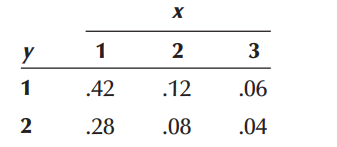
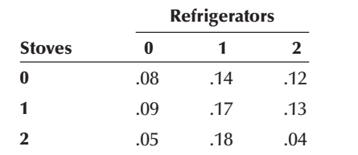

# Random variable Probability Distribution

## Definition

A **variable** is said to be **random** if its values are determined by a random experiment. In other word, **random variable** is a numerical description of the outcome of an experiment.

-   A random variable often denoted with an uppercase letter (say $X$)

-   The value of a random variable is denoted with a lowercase letter (say $x$)

**Illustration** Consider a random experiment of tossing a coin (fair/unfair) 2 times. Then the sample space is

$$
S=\{ HH,HT,TH,TT \}
$$

Now let, $X= number\ \  of\ \  heads \ \ occur$

From the sample space we can see that $X$ can take following values:

|                  |     |
|:----------------:|:---:|
| **Sample point** | $x$ |
|       $HH$       |  2  |
|       $HT$       |  1  |
|       $TH$       |  1  |
|       $TT$       |  0  |

Since the values of $X$ completely determined by the outcomes of the random experiment, so $X$ is a random variable (discrete).

## Types of random variable

There are two types of random variables, **discrete** and **continuous**.\
A **discrete random variable** can assume only a certain number of separated values. A discrete random variable is usually the result of *counting* something. [For example,]{.underline} number of customers arrive, number of calls receive etc.

A **continuous random variable** is one whose values are uncountable or which can take any value in a given interval. Generally a continuous random variable is usually the result of *measuring* something.

## Discrete random variable and Probability mass function (PMF)

Suppose $X$ is a discrete random variable. The **probability mass function (PMF)** of $X$ can be denoted as $f(x)$ where

$$ f(x)=P(X=x) $$For each possible outcome $x$ ; $f(x)$ must satisfies:

1.  $$f(x) \ge 0$$

2.  $$\sum _x f(x)=1$$

The **PMF** $f(x)$ is also called probability distribution of the discrte random variable $X$.

**Example 5.1** John Ragsdale sells new cars for Pelican Ford. John usually sells the largest number of cars on Saturday. He has developed the following probability distribution for the number of cars he expects to sell on a particular Saturday.

|                              |                         |
|:----------------------------:|:-----------------------:|
| **Number of cars sold,** $x$ | **Probability,** $f(x)$ |
|              0               |          0.10           |
|              1               |          0.20           |
|              2               |          0.30           |
|              3               |          0.30           |
|              4               |          0.10           |

**Compute** (i) $P(X=2)$ ; (ii) $P(X<2)$ ; (iii) $P(X \ge 3)$\

### Expectation (Mean) of discrete random variable

Let $X$ be a discrete random variable with probability mass function $f(x) = P(X = x)$.

The **expected value of** $X$ the mean of $X$ is denoted by $E(X)$ and defined by:

$$
E(X)=\sum_x x.f(x)
$$

The expected value of $X$ is sometimes called the population mean of $X$ that is $\mu=E(X)$.

**Example 5.2** John Ragsdale sells new cars for Pelican Ford. John usually sells the largest number of cars on Saturday. He has developed the following probability distribution for the number of cars he expects to sell on a particular Saturday.

|                              |                         |
|:----------------------------:|:-----------------------:|
| **Number of cars sold,** $x$ | **Probability,** $f(x)$ |
|              0               |          0.10           |
|              1               |          0.20           |
|              2               |          0.30           |
|              3               |          0.30           |
|              4               |          0.10           |

On a typical Saturday, how many cars does John expect to sell?\

[Solution:]{.underline}

|    $x$    |    $f(x)$     |        $x \cdot f(x)$        |
|:---------:|:-------------:|:----------------------------:|
|     0     |     0.10      |             0.00             |
|     1     |     0.20      |             0.20             |
|     2     |     0.30      |             0.60             |
|     3     |     0.30      |             0.90             |
|     4     |     0.10      |             0.40             |
| **Total** | $\sum f(x)=1$ | $\mu =\sum x\cdot f(x)=2.10$ |

: Calculation of the Expected Value for the Number of Cars Sold

**Alternative:** The mean number of cars is:

$$\mu =E[X]=\sum_{x=0}^4 x.f(x)$$

$$=0(0.10)+1(0.20)+2(0.30)+3(0.30)+4(0.10)=2.1$$

So on a typical Saturday, John Ragsdale expects to sell a mean of 2.1 cars a day.

### Variance of discrete random variable

Let $X$ be a discrete random variable with probability distribution $f(x)$ and mean $\mu$. The variance of $X$ is

$$var(X)=\sigma^2 =E[(X-\mu)^2]=\sum_x (x-\mu)^2 f(x)$$**Alternative:**

$$var (X)=E(X^2)-\mu^2$$ Where,

$$E(X^2)=\sum_{x} x^2.f(x)$$

**Example 5.3:** From Example 5.2 **compute** *variance* and *standard deviation* of $X$.

[Solution:]{.underline} From Example 5.2 we have $\mu =2.1$.

|    $x$    |    $f(x)$     | $x-\mu$ | $(x-\mu)^2$ | $(x-\mu)^2 f(x)$  |
|:---------:|:-------------:|:-------:|:-----------:|:-----------------:|
|     0     |     0.10      |  -2.1   |    4.41     |       0.441       |
|     1     |     0.20      |  -1.1   |    1.21     |       0.242       |
|     2     |     0.30      |  -0.1   |    0.01     |       0.003       |
|     3     |     0.30      |   0.9   |    0.81     |       0.243       |
|     4     |     0.10      |   1.9   |    3.61     |       0.361       |
| **Total** | $\sum f(x)=1$ |         |             | $\sigma^2 =1.290$ |

: Calculation of the Variance for the Number of Cars Sold

\
**Alternative:** Here,

$$E(X^2)=\sum_{x=0}^4 x^2.f(x)$$

$=0^2(0.10)+1^2 (0.20)+2^2 (0.30)+3^2 (0.30)+4^2 (0.10)$

$=5.70$

Hence, $var(X)=\sigma^2 =E(X^2)-\mu^2=5.70-(2.10)^2=1.29$

-   The variance is, $\sigma^2=1.29$ and

-   The standard deviation is, $\sigma=\sqrt {1.29}=1.136$

::: callout-note
## Properties of E(.) and var(.)

If $a$ and $b$ are constants, then

a\) $E(b)=b$

b\) $E(aX+b)=aE(X)+b$

c\) $var(b)=0$

d\) $var(aX+b)=a^2 \ \ var (X)$
:::

### Exercise: Discrete random variable

5.1) Which of these variables are discrete and which are continuous random variables?

a\. The number of new accounts established by a salesperson in a year.

b\. The time between customer arrivals to a bank ATM.

c\. The number of customers in Big Nick’s barber shop.

d\. The amount of fuel in your car’s gas tank.

e\. The number of minorities on a jury.

f\. The outside temperature today.\

5.2) Compute the mean and variance of the following probability distribution.

|     |        |
|:---:|:------:|
| $x$ | $f(x)$ |
|  5  |  0.10  |
| 10  |  0.30  |
| 15  |  0.20  |
| 20  |  0.40  |

5.3) The information below is the number of daily emergency service calls made by the volunteer ambulance service of Walterboro, South Carolina, for the last 50 days. To explain, there were 22 days on which there were 2 emergency calls, and 9 days on which there were 3 emergency calls.

|                     |               |
|:-------------------:|:-------------:|
| **Number of calls** | **Frequency** |
|          0          |       8       |
|          1          |      10       |
|          2          |      22       |
|          3          |       9       |
|          4          |       1       |
|      **Total**      |    **50**     |

a\. Convert this information on the number of calls to a probability distribution.

b\. Is this an example of a discrete or continuous probability distribution?

c\. What is the mean number of emergency calls per day?

d\. What is the standard deviation of the number of calls made daily?

5.4) Consider the following probability distribution of random variable $X$:

|        |     |     |     |     |
|:------:|:---:|:---:|:---:|:---:|
|  $x$   |  1  |  3  |  5  |  7  |
| $f(x)$ |  k  | 2k  | 2k  | 3k  |

\(i\) Find the value of k.

\(ii\) Find the probability of the value of X exactly 4.

\(iii\) Find the probability of the value of X between 3 and 7 (inclusive).

\(iv\) Estimate expected value and standard deviation of X.

### Joint distribution of two discrete r.vs

The function $f(x, y)$ is a **joint probability distribution** or **probability mass function** of the discrete random variables $X$ and $Y$ if

1.  $f(x,y)\ge 0$ for all $(x,y)$,
2.  $\sum_x \sum_y f(x,y)=1$,
3.  $P(X=x, Y=y)=f(x,y)$

### Marginal distribution $X$ and $Y$ (discrete)

The marginal distributions of $X$ alone and of $Y$ alone are

1.  $f_X(x)=\sum_y f(x,y)$
2.  $f_Y(y)=\sum_x f(x,y)$

### Stochastic independence of Jointly Distributed Random Variables

If $f(x,y)=f_X(x)\times f_Y(y)$ for all $x$ and $y$ the then the random variables $X$ and $Y$ will said to be independent.

### Covariance and correlation between $X$ and $Y$

::: callout-note
## Covariance

$$
Cov(X,Y)=\sigma_{XY}=E \left[ (X-\mu_X)(Y-\mu_Y)\right]
$$

In other way,

$$
Cov(X,Y)=\sigma_{XY}=E(XY)-\mu_X\mu_Y
$$
:::

::: callout-note
## Correlation coefficient

$$
\rho=\frac{\sigma_{XY}}{\sigma_X \sigma_Y}\ \ ; -1\le\rho\le+1
$$
:::

### Laws of Expected Value and Variance of the Linear combination of Two Variables

Suppose a new random variable is $Z$ as follows:

$$
Z=aX+bY
$$

Where $a$ and $b$ are both constants.

1.  $E(Z)=E(aX+bY)=aE(X)+bE(Y)$,
2.  $Var(Z)=Var(aX+bY)=a^2 Var(X)+b^2 Var(Y)+2ab \ \ Cov (X,Y)$

**N.B:** If $X$ *and* $Y$ *are independent,* $Cov(X,Y ) = 0$.

### Some problems on discrete joint distribution

**Problem 7.5.1** The joint probability distribution of X and Y is shown in the following table.

{width="251"}

a\. Determine the marginal distributions of $X$ and $Y$ .

b\. Compute the covariance and coefficient of correlation between $X$ and $Y$ .

c\. Develop the probability distribution of $X + Y$ .

d\. Find $P(X+Y\le 3)$.\

**Problem 7.5.2** After analyzing several months of sales data, the owner of an appliance store produced the following joint probability distribution of the number of refrigerators and stoves sold daily.

{width="305"}

a\. Find the marginal probability distribution of the number of refrigerators sold daily.

b\. Find the marginal probability distribution of the number of stoves sold daily.

c\. Compute the mean and variance of the number of refrigerators sold daily.

d\. Compute the mean and variance of the number of stoves sold daily.

e\. Compute the covariance and the coefficient of correlation.\

## Continuous r.v and Probability density function (PDF)

**Definition:** A continuous r.v $X$ must have a probability density function (PDF) $f(x)$ such that

$1) f(x) \ge 0$ **\[Non-negativity\]**

$2) \int_{x\in \mathbb{R}} f(x)dx =1$ **\[Total AREA under the curve** $f(x)$ always 1\]

### Illustration with an example

Given $f(x)=\frac{1}{2}x \ \ ; 0\le x\le 2$

a\) Show/plot the graph of $f(x)$.

b\) Is $f(x)$ a PDF?

c\) Find $P(X<1.0)$.

d\) Find $P(X=1.0)$

***Solution:***

\(a\)

```{r fig.width=4, fig.height=2,fig.align='center'}
par(mar = c(1.8, 2, 1, 1))

curve(0.5*x,ylab = "f(x)",lwd=2,col="red",xlim=c(0,2),main="Graph of  f(x)=0.5x", cex.axis=0.7,cex.lab=1.0,cex.main=0.8)
```

b\) Here, $f(x)\ge 0$ for all values of $x$ in the interval $0\le x\le2$.

Now, **total area under curve** $f(x)$ from $x=0$ to $x=2$ is

$\int_{0}^2 f(x)dx$

$=AREA \ \ of\ \  the\ \  SHADED\ \  Triangle$

```{r fig.width=4, fig.height=2,fig.align='center'}
par(mar = c(1.8, 2, 1, 1))
# Create a plot
plot(1, type = "n", xlab = "x", ylab = "f(x)",main="", 
     xlim = c(0, 2), ylim = c(0, 1), 
     cex.axis=1.0,cex.lab=1.0,cex.main=1)

# Define the vertices of the triangle
x <- c(0, 2, 2)
y <- c(0, 0, 1)

# Draw the triangle
polygon(x, y,  border = "blue")
polygon(x,y,col="lightblue")
text(1.5, 0.3, labels = "P(0<X<2)=1", pos = 3, col = "black")

```

$$
=\frac{1}{2} \times base\times height
$$

$$
=\frac{1}{2} \times 2\times 1=1
$$

So, total area under curve $f(x)$ is $1$ that is $\int_{0}^{2} f(x)dx=1$.

Hence, $f(x)$ is a PDF.

c\) Here,

$$
P(X<1)=Area \ \ under\ \ the \ \ curve \ \ from \ \ x=0 \ \ to  \ \ x=1
$$

$$
=Area \ \ of \ \ the \ \ SHADED \ \ Triangle
$$

```{r fig.width=4, fig.height=2,fig.align='center'}
par(mar = c(1.8, 2, 1, 1))
# Create a plot
plot(1, type = "n", xlab = "x", ylab = "f(x)",main="", 
     xlim = c(0, 2), ylim = c(0, 1), 
     cex.axis=0.8,cex.lab=0.8,cex.main=0.9)

# Define the vertices of the triangle
x <- c(0, 2, 2)
y <- c(0, 0, 1)

# Draw the triangle
polygon(x, y,  border = "blue")
polygon(c(0,1,1),c(0,0,.5),col="lightblue")
# Add labels to the vertices
text(0.73, 0.1, labels = "P(X<1)=0.25", pos = 3, col = "black",cex=.8)


```

$$
=\frac{1}{2}\times 1 \times f(1)=\frac{1}{2}\times 1 \times 0.5=0.25
$$

Therefore $P(X<1)=0.25$

d\) $P(X=1.0)=0$ \[Because there is no area at $x=1.0$\]

::: callout-note
We always remember that **Probability in an interval of** $X$ is a**ctually the** $AREA$ **under the pdf** $f(x)$**.**
:::

**Problem 6.2.1** A random variable has the following density function.

$$
f(x)=1-0.5x \ \ ; \ \ 0<x<2
$$

a) Graph the density function.

b\) Verify that $f(x)$ is a density function.

c\) Find $P(X>1)$.

d\) Find $P(X<0.5)$.

e\) Find $P(X=1.5)$.

**Problem 6.2.2** The following function is the density function for the random variable X :

$$
f(x)=\frac{x-1}{8} \ \ ; 1<x<5
$$

a\) Graph the density function.

b\) Find the probability that X lies between 2 and 4.

c\) What is the probability that X is less than 3?

### Expectation and variance of continuous r.v

If $X$ is a continuous r.v with PDF $f(x)$ then

Expected value of $X$ is

$$
\mu=E(X)= \int_{x\in \mathbb{R}} x\cdot f(x)dx
$$ Variance of $X$ is

$$
Var(X)=E(X^2)-\mu^2=\int_{x\in \mathbb{R}} x^2\cdot f(x)dx-\mu^2
$$

### Joint distribution of two continuous r.vs

The function $f(x, y)$ is a joint density function of the continuous random variables $X$ and $Y$ if

1.  $f(x,y)\ge 0$,
2.  $\int_{-\infty}^\infty \int_{-\infty}^\infty f(x,y)\ \ dx\ \ dy=1$.

### Marginal distribution $X$ and $Y$ (continuous )

The marginal distributions of $X$ alone and of $Y$ alone are

1.  $f_X(x)= \int_{-\infty}^\infty f(x,y) \ \ dy$,
2.  $f_Y(y)= \int_{-\infty}^\infty f(x,y) \ \ dx$

### Some problem on continuous joint distribution

Let $X$ denote the reaction time, in seconds, to a certain stimulus and $Y$ denote the temperature (◦F) at which a certain reaction starts to take place. Suppose that two random variables $X$ and Y have the joint density.

$$
f(x, y) = \begin{cases} 
4xy, & 0 < x < 1, \, 0 < y < 1, \\
0, & \text{elsewhere}.
\end{cases}
$$

Find

a\. $P(0\le X \le \frac{1}{2} \ \ {and}\ \ \frac{1}{4} \le Y\le \frac{1}{2})$;

b\. $P(X<Y)$.
