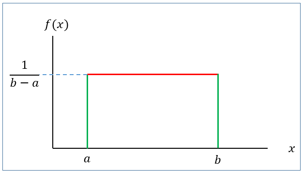
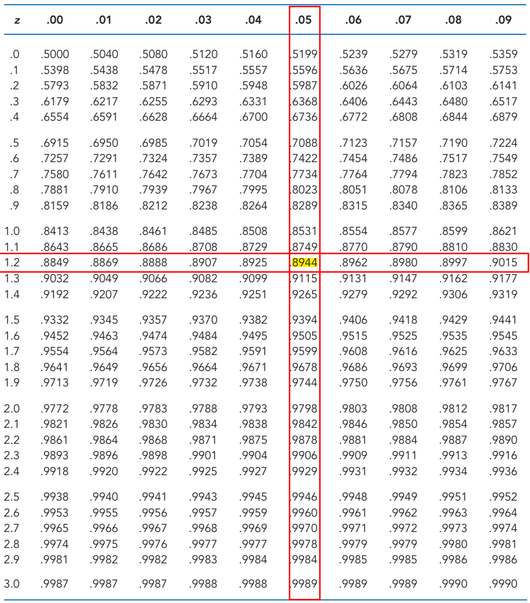

# Family of continuous random variables

## Uniform probability distribution/r.v

A continuous r.v $X$ is said to be uniform r.v ranges between $a$ to $b$ if it has the following PDF

$$
f(x)=\frac{1}{b-a} \ \ ; \ \ a<x<b
$$ {#eq-unif.pdf}

{#fig-Uniform fig-align="left" width="329"}

with

**Mean:** $\mu=E(X)=\frac{a+b}{2}$

**Variance:** $\sigma^2=\frac{(b-a)^2}{12}$

[**We write,**]{.underline} $X\sim U(a,b)$

### Finding probability for uniform r.v [@keller2014]

If $X\sim U(a,b)$ then the $P(x_1<X<x_2)$ is actually the **area of the shaded rectangle.**

{#fig-areaunif fig-align="left" width="298"}

That is,

$$
P(x_1<X<x_2)=Base\times Heght=(x_2-x_1)\times \frac{1}{b-a}
$$

**Problem 6.4.1** The random variable $X$ is known to be uniformly distributed between 10 and 30.

a\) Show the graph of the probability density function.

b\) Compute $P(X<15)$.

c\) Compute $P(X\ge 22)$.

d\) Compute $P(13 \le X<23)$.

e\) Compute $P(X=29)$.

f\) Compute $E(X)$.

g\) Compute $Var(X)$ and $SD(X)$.\

\

**Problem 6.4.2** [@keller2014, page 263] The amount of gasoline sold daily at a service station is uniformly distributed with a minimum of 2,000 gallons and a maximum of 5,000 gallons.

a.  Find the probability that daily sales will fall between 2,500 and 3,000 gallons.

b.  What is the probability that the service station will sell at least 4,000 gallons?

c.  What is the probability that the station will sell exactly 2,500 gallons?

d.  What is the **mean** and **standard deviation** of amount of daily gasoline sold? (\*)

**Problem 6.4.3** [@keller2014, page 265] The weekly output of a steel mill is a uniformly distributed random variable that lies between 110 and 175 metric tons.

a.  Compute the probability that the steel mill will produce more than 150 metric tons next week.

b.  Determine the probability that the steel mill will produce between 120 and 160 metric tons next week.

c.  The operations manager labels any week that is in the bottom 20% of production a “bad week.” How many metric tons should be used to define a bad week? (\*)

**Problem 6.4.4** [@keller2014, page 265] The amount of time it takes for a student to complete a statistics quiz is uniformly distributed between 30 and 60 minutes. One student is selected at random. Find the probability of the following events.

a.  The student requires more than 55 minutes to complete the quiz.

b.  The student completes the quiz in a time between 30 and 40 minutes.

c.  The student completes the quiz in exactly 37.23 minutes.

**Problem 6.4.5** [@keller2014, page 265] Refer to previous problem.

a.  The professor wants to reward (with bonus marks) students who are in the lowest quarter of completion times. What completion time should he use for the cutoff for awarding bonus marks? (\*)

b.  The professor would like to track (and possibly help) students who are in the top 10% of completion times. What completion time should he use? (\*)

## Normal distribution/r.v

The normal distribution is arguably the most popular and commonly used distribution. It is compatible with a wide range of human attributes, including height, weight, length, speed, IQ, academic success, and years of life expectancy.\
\
A large number of business and industrial variables are also normally distributed. Several variables, such as the annual cost of household insurance, the cost per square foot of warehouse space rental, and managers' happiness with ownership support on a five-point scale, could result in data that are normally distributed. Also, most things that are manufactured or filled by machines are normally distributed.

Due to its numerous uses, the normal distribution is a very significant distribution. In addition to the several variables that are normally distributed that have been described, **statistical inference**, **statistical process control** rely heavily on the normal distribution. No matter the form of the underlying distribution from which they are derived, many statistics are normally distributed when sufficiently large sample sizes are obtained [@black2012].

### Definition

A continuous r.v $X$ is said to be normal r.v if it has the following **PDF:**

$$
f(x)=\frac{1}{\sigma \sqrt{2\pi}} e^{-\frac{1}{2} (\frac{x-\mu}{\sigma})^2}\ \ ; -\infty<x<\infty
$$ {#eq-normal}

The graph of $f(x)$ is called **normal curve** (@fig-normalpdf)**.**

```{r fig.height=2.5, fig.width=5}
#| label: fig-normalpdf
#| fig-cap: "Normal Curve"
#| fig-align: left

library(tidyverse)

# Create a sequence of x values
x <- seq(10, 30, length = 100)

# Calculate the y values for the normal distribution
y <- dnorm(x,20,3)

# Create a data frame
data <- data.frame(x, y)


ggplot(data, aes(x = x, y = y)) +
  geom_line(color = "blue",lwd=1) +
  labs(title = " ", 
  x=expression(mu), y = "f(x)")+
  geom_vline(xintercept=20)+
  theme_classic()+
  theme(axis.text=element_blank(),
        axis.title = element_text(size = 14),
        plot.title = element_text(hjust = 0.5)
        )->normal.curve
normal.curve  
```

**Mean:** $E(X)=\mu$

**Variance:** $Var(X)=\sigma^2$

[**We write:**]{.underline} $X\sim N(\mu , \sigma^2)$

**Properties of normal distribution**

-   The **total area** under the normal curve $f(x)$ is 1 that is

    $$
    \int_{-\infty}^{\infty} f(x)dx=1
    $$

-   Normal distribution is symmetric about mean, $\mu$

-   Mean, median and mode is identical in normal distribution that is $Mean=Median=Mode=\mu$

-   Almost $99\%$ observations of $X$ lie within **3 standard deviation of mean** that is

    $$
    P(\mu-3\sigma<X<\mu+3\sigma)\approx 0.99
    $$

-   Almost $95\%$ observations of $X$ lie within **2 standard deviation of mean** that is $$
    P(\mu-2\sigma<X<\mu+2\sigma)\approx 0.95
    $$

-   Almost $68\%$ observations of $X$ lie within **1 standard deviation of mean** that is $$
    P(\mu-\sigma<X<\mu+\sigma)\approx 0.68
    $$

### Standard normal r.v

Suppose $X\sim N(\mu, \sigma^2)$. Then the variable $Z=\frac{X-\mu}{\sigma}$ is said to be **standard normal variable** with **PDF**

$$
f(z)=\frac{1}{\sqrt {2\pi}} e^ \frac{-z^2}{2} \ \ ; -\infty<z<\infty
$$ {#eq-standardnorm}

**Mean:** $E(Z)=0$

**Variance:** $Var(Z)=1$

[**We write:**]{.underline} $Z\sim N(0,1)$

```{r fig.height=2.5, fig.width=5}
#| label: fig-zcurve
#| fig-align: left
#| fig-cap: "Standard normal curve"

par(mar = c(3.77, 3.77, 1, 1))

fz=function(x) {(1/sqrt(2*pi))*exp(-x^2)}

curve(fz,from = -3.2, to = 3.2,
      xlab = "z",ylab = "f(z)",lwd=2)

abline(v = 0, col = "red", lwd = 2)


```

### Computing probability(area) under standard normal curve

To compute area (probability) under the standard normal curve for a given interval of $z$ we use **standard Normal Distribution** **table** which provides cumulative probabilities.

**RULE-I:** Suppose we want to find $P(Z<1.25)$.

From TABLE 1 (Appendix B) in @anderson2020 we have

$$
P(Z<1.25)=0.8944
$$

\
{width="552"}

The probability $P(Z<1.25)$ is shown in @fig-areaz.

```{r fig.height=2.5, fig.width=5}
#| label: fig-areaz
#| fig-cap: "Area under standard normal curve for Z<1.25"
#| fig-align: left

# Load ggplot2 package
library(ggplot2)

# Define the mean and standard deviation
mean <- 0
sd <- 1

# Define the shading bounds for the central 95% interval
lower <- -1.96  # Lower bound (e.g., -1.96 for 95% CI)
upper <- 1.96   # Upper bound (e.g., 1.96 for 95% CI)

# Create a data frame to specify the x range
x_range <- data.frame(x = c(-4, 4))

# Create the plot
ggplot(x_range, aes(x)) +
  scale_x_continuous(breaks = seq(-4,4,1)) +
  # Plot the normal distribution curve
  stat_function(fun = dnorm, args = list(mean = mean, sd = sd)) +
  
  # Shade the area under the curve between the lower and upper bounds
  stat_function(fun = dnorm, args = list(mean = mean, sd = sd), geom = "area", 
                xlim = c(-4, 1.25), fill = "skyblue", alpha = 0.5) +
  
  # Labels and theme
  labs(x = "z", y = "f(z)", title = "") +
  theme_classic()+
  annotate("text",x=0,y=0.15,label="P(Z<1.25)=0.8944")

```

**RULE-II:** Now we find $P(Z>1.36)$

So, due to symmetry we can write $P(Z>1.36)=P(Z<-1.36)=0.0869$\

```{r fig.height=2.5, fig.width=5}
#| label: fig-areaz2
#| fig-cap: "Area under standard normal curve for Z>1.36"
#| fig-align: left

# Create the plot
ggplot(x_range, aes(x)) +
  scale_x_continuous(breaks = seq(-4,4,1)) +
  # Plot the normal distribution curve
  stat_function(fun = dnorm, args = list(mean = 0, sd = 1)) +
  
  # Shade the area under the curve between the lower and upper bounds
  stat_function(fun = dnorm, args = list(mean = mean, sd = sd), geom = "area", xlim = c(1.36, 4), fill = "skyblue", alpha = 0.5) +
  
  # Labels and theme
  labs(x = "z", y = "f(z)", title = "") +
  theme_classic()+
  annotate("text",x=3,y=0.1,label="P(Z>1.36)=0.0869")
```

**RULE-III:** Let us evaluate $P(-1.96<Z<2.58)$.

We can write

$$
=P(-1.96<Z<2.58)
$$

$$
=P(Z<2.58)-P(Z<-1.96)
$$

$$
=0.9951-0.0250=0.9701
$$

```{r fig.height=2.5, fig.width=5}
#| label: fig-areaz3
#| fig-cap: "Area under standard normal curve for -1.96<Z<2.58"
#| fig-align: left

# Create the plot
ggplot(x_range, aes(x)) +
  scale_x_continuous(breaks = seq(-4,4,1)) +
  # Plot the normal distribution curve
  stat_function(fun = dnorm, args = list(mean = 0, sd = 1)) +
  
  # Shade the area under the curve between the lower and upper bounds
  stat_function(fun = dnorm, args = list(mean = mean, sd = sd), geom = "area", xlim = c(-1.96, 2.58), fill = "skyblue", alpha = 0.5) +
  
  # Labels and theme
  labs(x = "z", y = "f(z)", title = "") +
  theme_classic()+
  annotate("text",x=-.02,y=.1,label="P(-1.96<Z<2.58)=0.9701")
```

### Finding quantiles (percentiles, quartiles, deciles etc) of $Z$

What is the $90^{th}$ percentile of $Z$? To answer this question, let $k$ is the $90^{th}$ percentile of $Z$. So we can write

$$
P(Z<k)=0.90 \ \  \ \ \ \ \ \ \ \cdot \cdot \cdot (1)
$$

From TABLE 1 (Appendix-B) [@anderson2020] we have

$$
P(Z<1.28)=0.90 \ \  \ \ \ \ \ \ \ \cdot \cdot \cdot(2)
$$

Comparing eq.(1) with eq.(2) we have $k=1.28$. So the $90^{th}$ percentile of $Z$ is $1.28$.

**Problem 1** Find $c$ such that $P(Z>c)=0.05$.

**Problem 2** Find $c$ such that $P(-c<Z<c)=0.95$.

### Computing probability(area) under normal curve:

Suppose $X\sim N(30, 5^2)$ . Then find the following:

a\) $P(X<22)$

b\) $P(X>44)$

c\) $P(20<X<35)$

d\) If $P(X<x)=0.25$ then find the value of $x$.

***Solution:***

Here, $\mu=30$ and $\sigma=5$

------------------------------------------------------------------------

a\) $P(X<22)=P(\frac{X-\mu}{\sigma}<\frac{22-30}{5})=P(Z<-1.60)=0.0548$.

------------------------------------------------------------------------

b\) $P(X>44)=P(\frac{X-\mu}{\sigma}>\frac{44-30}{5})$

$=P(Z>2.80)=P(Z<-2.80)=0.0026$

------------------------------------------------------------------------

c\) $P(20<X<35)=P(\frac{20-30}{5}<\frac{X-\mu}{\sigma}<\frac{35-30}{5})$

$=P(-2<Z<1)=P(Z<1)-P(Z<-2)$

$=0.8413-0.0228=0.8185$

------------------------------------------------------------------------

d\) To find the value of $x$ we proceed this way.

$$
P(X<x)=0.25
$$ $$
\implies P(\frac{X-\mu}{\sigma}<\frac{x-30}{5})=0.25
$$

$$
\implies P(Z<\frac{x-30}{5})=0.25 \ \ \ \ \ \cdot \cdot \cdot (1)
$$

From TABLE (Appendix B) we have

$$
P(Z<-0.67)=0.25  \ \ \ \ \cdot \cdot \cdot (2)
$$

Comparing (1) with (2) we can write

$$
\frac{x-30}{5}=-0.67
$$ $$
\implies x=30+(-0.67)\times 5
$$

$$
\therefore x=26.65
$$

::: callout-note
If $P(X<x)=p$ and

$P(Z<z)=p$ then

$$
x=\mu+z\sigma
$$
:::

### Applications

In this section we will discuss about some problems which are connected to the normal distribution.

**Problem 6.5.1** [@anderson2020, 298] Automobile repair costs continue to rise with an average 2015 cost of \$367 per repair (U.S. News & World Report website). Assume that the cost for an automobile repair is normally distributed with a standard deviation of \$88. Answer the following questions about the cost of automobile repairs.

a\. What is the probability that the cost will be more than \$450?

b\. What is the probability that the cost will be less than \$250?

c\. What is the probability that the cost will be between \$250 and \$450?

d\. If the cost for your car repair is in the lower 5% of automobile repair charges, what is your cost?\

**Problem 6.5.2** [@anderson2020, 298] Labor Day Travel Costs. The American Automobile Association (AAA) reported that families planning to travel over the Labor Day weekend spend an average of \$749. Assume that the amount spent is normally distributed with a standard deviation of \$225.

a\. What is the probability of family expenses for the weekend being less that \$400?

b\. What is the probability of family expenses for the weekend being \$800 or more?

c\. What is the probability that family expenses for the weekend will be between \$500 and \$1000?

d\. What would the Labor Day weekend expenses have to be for the 5% of the families with the most expensive travel plans?\

**Problem 6.5.3** [@keller2014 , 280] A new gas–electric hybrid car has recently hit the market. The distance traveled on 1 gallon of fuel is normally distributed with a mean of 65 miles and a standard deviation of 4 miles. Find the probabilityof the following events.

a\. The car travels more than 70 miles per gallon.

b\. The car travels less than 60 miles per gallon.

c\. The car travels between 55 and 70 miles per gallon.

**Problem 6.5.4** [@anderson2020, 298] Mensa Membership. A person must score in the upper 2% of the population on an IQ test to qualify for membership in Mensa, the international high-IQ society. If IQ scores are normally distributed with a mean of 100 and a standard deviation of 15, what score must a person have to qualify for Mensa?

**Problem 6.5.5** [@keller2014 , 282] The lifetimes of televisions produced by the Hishobi Company are normally distributed with a mean of 75 months and a standard deviation of 8 months. If the manufacturer wants to have to replace only 1% of its televisions, what should its warranty be?\

**Problem 6.5.6** [@newbold2013, page 218] I am considering two alternative investments. In both cases I am unsure about the percentage return but believe that my uncertainty can be represented by normal distributions with the means and standard deviations shown in the accompanying table. I want to make the investment that is more likely to produce a return of at least 10%. Which investment should I choose?

|              |      |                    |
|--------------|:----:|:------------------:|
|              | Mean | Standard deviation |
| Investment A | 10.4 |        1.2         |
| Investment B | 11.0 |        4.0         |

\
