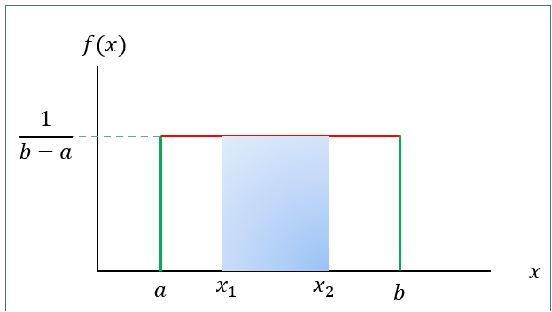

# Continuous Probability Distributions

## Probability density function (PDF)

**Definition:** A continuous r.v $X$ must have a probability density function (PDF) $f(x)$ such that

$1) f(x) \ge 0$ **\[Non-negativity\]**

$2) \int_{x\in \mathbb{R}} f(x)dx =1$ **\[Total AREA under the curve** $f(x)$ always 1\]

### Illustration with an example

Given $f(x)=\frac{1}{2}x \ \ ; 0\le x\le 2$

a\) Show/plot the graph of $f(x)$.

b\) Is $f(x)$ a PDF?

c\) Find $P(X<1.0)$.

d\) Find $P(X=1.0)$

***Solution:***

\(a\)

```{r fig.width=4, fig.height=2,fig.align='center'}
par(mar = c(1.8, 2, 1, 1))

curve(0.5*x,ylab = "f(x)",lwd=2,col="red",xlim=c(0,2),main="Graph of  f(x)=0.5x", cex.axis=0.7,cex.lab=1.0,cex.main=0.8)
```

b\) Here, $f(x)\ge 0$ for all values of $x$ in the interval $0\le x\le2$.

Now, **total area under curve** $f(x)$ from $x=0$ to $x=2$ is

$\int_{0}^2 f(x)dx$

$=AREA \ \ of\ \  the\ \  SHADED\ \  Triangle$

```{r fig.width=4, fig.height=2,fig.align='center'}
par(mar = c(1.8, 2, 1, 1))
# Create a plot
plot(1, type = "n", xlab = "x", ylab = "f(x)",main="", 
     xlim = c(0, 2), ylim = c(0, 1), 
     cex.axis=1.0,cex.lab=1.0,cex.main=1)

# Define the vertices of the triangle
x <- c(0, 2, 2)
y <- c(0, 0, 1)

# Draw the triangle
polygon(x, y,  border = "blue")
polygon(x,y,col="lightblue")
text(1.5, 0.3, labels = "P(0<X<2)=1", pos = 3, col = "black")

```

$$=\frac{1}{2} \times base\times height$$

$$=\frac{1}{2} \times 2\times 1=1$$

So, total area under curve $f(x)$ is $1$ that is $\int_{0}^{2} f(x)dx=1$.

Hence, $f(x)$ is a PDF.

c\) Here,

$$P(X<1)=Area \ \ under\ \ the \ \ curve \ \ from \ \ x=0 \ \ to  \ \ x=1$$

$$=Area \ \ of \ \ the \ \ SHADED \ \ Triangle$$

```{r fig.width=4, fig.height=2,fig.align='center'}
par(mar = c(1.8, 2, 1, 1))
# Create a plot
plot(1, type = "n", xlab = "x", ylab = "f(x)",main="", 
     xlim = c(0, 2), ylim = c(0, 1), 
     cex.axis=0.8,cex.lab=0.8,cex.main=0.9)

# Define the vertices of the triangle
x <- c(0, 2, 2)
y <- c(0, 0, 1)

# Draw the triangle
polygon(x, y,  border = "blue")
polygon(c(0,1,1),c(0,0,.5),col="lightblue")
# Add labels to the vertices
text(0.73, 0.1, labels = "P(X<1)=0.25", pos = 3, col = "black",cex=.8)


```

$$=\frac{1}{2}\times 1 \times f(1)=\frac{1}{2}\times 1 \times 0.5=0.25$$

Therefore $P(X<1)=0.25$

d\) $P(X=1.0)=0$ \[Because there is no area at $x=1.0$\]

::: callout-note
We always remember that **Probability in an interval of** $X$ is a**ctually the** $AREA$ **under the pdf** $f(x)$**.**
:::

**Problem 6.2.1** A random variable has the following density function.

$$f(x)=1-0.5x \ \ ; \ \ 0<x<2$$

a)  Graph the density function.

b\) Verify that $f(x)$ is a density function.

c\) Find $P(X>1)$.

d\) Find $P(X<0.5)$.

e\) Find $P(X=1.5)$.

**Problem 6.2.2** The following function is the density function for the random variable X :

$$f(x)=\frac{x-1}{8} \ \ ; 1<x<5$$

a\) Graph the density function.

b\) Find the probability that X lies between 2 and 4.

c\) What is the probability that X is less than 3?

### Expectation and variance of continuous r.v

If $X$ is a continuous r.v with PDF $f(x)$ then

Expected value of $X$ is

$$\mu=E(X)= \int_{x\in \mathbb{R}} x\cdot f(x)dx$$ Variance of $X$ is

$$Var(X)=E(X^2)-\mu^2=\int_{x\in \mathbb{R}} x^2\cdot f(x)dx-\mu^2$$

## Uniform probability distribution/r.v

A continuous r.v $X$ is said to be uniform r.v ranges between $a$ to $b$ if it has the following PDF

$$f(x)=\frac{1}{b-a} \ \ ; \ \ a<x<b$$ {#eq-unif.pdf}

{#fig-Uniform fig-align="left" width="329"}

with

**Mean:** $\mu=E(X)=\frac{a+b}{2}$

**Variance:** $\sigma^2=\frac{(b-a)^2}{12}$

[**We write,**]{.underline} $X\sim U(a,b)$

### Finding probability for uniform r.v

If $X\sim U(a,b)$ then the $P(x_1<X<x_2)$ is actually the **area of the shaded rectangle.**

{#fig-areaunif width="326"}

That is,

$$P(x_1<X<x_2)=Base\times Heght=(x_2-x_1)\times \frac{1}{b-a}$$

**Problem 6.4.1** The random variable $X$ is known to be uniformly distributed between 10 and 30.

a\) Show the graph of the probability density function.

b\) Compute $P(X<15)$.

c\) Compute $P(X\ge 22)$.

d\) Compute $P(13 \le X<23)$.

e\) Compute $P(X=29)$.

f\) Compute $E(X)$.

g\) Compute $Var(X)$ and $SD(X)$.\

**Problem 6.4.2** [@keller2014, page 263] The amount of gasoline sold daily at a service station is uniformly distributed with a minimum of 2,000 gallons and a maximum of 5,000 gallons.

a.  Find the probability that daily sales will fall between 2,500 and 3,000 gallons.

b.  What is the probability that the service station will sell at least 4,000 gallons?

c.  What is the probability that the station will sell exactly 2,500 gallons?

d.  What is the **mean** and **standard deviation** of amount of daily gasoline sold? (\*)

**Problem 6.4.3** [@keller2014, page 265] The weekly output of a steel mill is a uniformly distributed random variable that lies between 110 and 175 metric tons.

a.  Compute the probability that the steel mill will produce more than 150 metric tons next week.

b.  Determine the probability that the steel mill will produce between 120 and 160 metric tons next week.

c.  The operations manager labels any week that is in the bottom 20% of production a “bad week.” How many metric tons should be used to define a bad week? (\*)

**Problem 6.4.4** [@keller2014, page 265] The amount of time it takes for a student to complete a statistics quiz is uniformly distributed between 30 and 60 minutes. One student is selected at random. Find the probability of the following events.

a.  The student requires more than 55 minutes to complete the quiz.

b.  The student completes the quiz in a time between 30 and 40 minutes.

c.  The student completes the quiz in exactly 37.23 minutes.

**Problem 6.4.5** [@keller2014, page 265] Refer to previous problem.

a.  The professor wants to reward (with bonus marks) students who are in the lowest quarter of completion times. What completion time should he use for the cutoff for awarding bonus marks? (\*)

b.  The professor would like to track (and possibly help) students who are in the top 10% of completion times. What completion time should he use? (\*)

## Normal distribution/r.v

The normal distribution is arguably the most popular and commonly used distribution. It is compatible with a wide range of human attributes, including height, weight, length, speed, IQ, academic success, and years of life expectancy.\
\
A large number of business and industrial variables are also normally distributed. Several variables, such as the annual cost of household insurance, the cost per square foot of warehouse space rental, and managers' happiness with ownership support on a five-point scale, could result in data that are normally distributed. Also, most things that are manufactured or filled by machines are normally distributed.

Due to its numerous uses, the normal distribution is a very significant distribution. In addition to the several variables that are normally distributed that have been described, **statistical inference**, **statistical process control** rely heavily on the normal distribution. No matter the form of the underlying distribution from which they are derived, many statistics are normally distributed when sufficiently large sample sizes are obtained [@black2012].

### Definition

A continuous r.v $X$ is said to be normal r.v if it has the following **PDF:**

$$f(x)=\frac{1}{\sigma \sqrt{2\pi}} e^{-\frac{1}{2} (\frac{x-\mu}{\sigma})^2}\ \ ; -\infty<x<\infty$$ {#eq-normal}

The graph of $f(x)$ is called **normal curve** (@fig-normalpdf)**.**

```{r fig.height=2.5, fig.width=5}
#| label: fig-normalpdf
#| fig-cap: "Normal Curve"
#| fig-align: left

library(tidyverse)

# Create a sequence of x values
x <- seq(10, 30, length = 100)

# Calculate the y values for the normal distribution
y <- dnorm(x,20,3)

# Create a data frame
data <- data.frame(x, y)


ggplot(data, aes(x = x, y = y)) +
  geom_line(color = "blue",lwd=1) +
  labs(title = " ", 
  x=expression(mu), y = "f(x)")+
  geom_vline(xintercept=20)+
  theme_classic()+
  theme(axis.text=element_blank(),
        axis.title = element_text(size = 14),
        plot.title = element_text(hjust = 0.5)
        )->normal.curve
normal.curve  
```

**Mean:** $E(X)=\mu$

**Variance:** $Var(X)=\sigma^2$

[**We write:**]{.underline} $X\sim N(\mu , \sigma^2)$

**Properties of normal distribution**

- The **total area** under the normal curve $f(x)$ is 1 that is

  $$\int_{-\infty}^{\infty} f(x)dx=1$$

- Normal distribution is symmetric about mean, $\mu$

- Mean, median and mode is identical in normal distribution that is $Mean=Median=Mode=\mu$

- Almost $99\%$ observations of $X$ lie within **3 standard deviation of mean** that is

  $$P(\mu-3\sigma<X<\mu+3\sigma)\approx 0.99$$

- Almost $95\%$ observations of $X$ lie within **2 standard deviation of mean** that is $$P(\mu-2\sigma<X<\mu+2\sigma)\approx 0.95$$

- Almost $68\%$ observations of $X$ lie within **1 standard deviation of mean** that is $$P(\mu-\sigma<X<\mu+\sigma)\approx 0.68$$

### Standard normal r.v

Suppose $X\sim N(\mu, \sigma^2)$. Then the variable $Z=\frac{X-\mu}{\sigma}$ is said to be **standard normal variable** with **PDF**

$$f(z)=\frac{1}{\sqrt {2\pi}} e^ \frac{-z^2}{2} \ \ ; -\infty<z<\infty$$ {#eq-standardnorm}

**Mean:** $E(Z)=0$

**Variance:** $Var(Z)=1$

[**We write:**]{.underline} $Z\sim N(0,1)$

```{r fig.height=2.5, fig.width=5}
#| label: fig-zcurve
#| fig-align: left
#| fig-cap: "Standard normal curve"

par(mar = c(3.77, 3.77, 1, 1))

fz=function(x) {(1/sqrt(2*pi))*exp(-x^2)}

curve(fz,from = -3.2, to = 3.2,
      xlab = "z",ylab = "f(z)",lwd=2)

abline(v = 0, col = "red", lwd = 2)


```

### Computing probability(area) under standard normal curve

To compute area (probability) under the standard normal curve for a given interval of $z$ we use **standard Normal Distribution** **table** which provides cumulative probabilities.

**RULE-I:** Suppose we want to find $P(Z<1.25)$.

From TABLE 1 (Appendix B) in @anderson2020 we have

$$P(Z<1.25)=0.8944$$

\
{width="552"}

The probability $P(Z<1.25)$ is shown in @fig-areaz.

```{r fig.height=2.5, fig.width=5}
#| label: fig-areaz
#| fig-cap: "Area under standard normal curve for Z<1.25"
#| fig-align: left

# Load ggplot2 package
library(ggplot2)

# Define the mean and standard deviation
mean <- 0
sd <- 1

# Define the shading bounds for the central 95% interval
lower <- -1.96  # Lower bound (e.g., -1.96 for 95% CI)
upper <- 1.96   # Upper bound (e.g., 1.96 for 95% CI)

# Create a data frame to specify the x range
x_range <- data.frame(x = c(-4, 4))

# Create the plot
ggplot(x_range, aes(x)) +
  scale_x_continuous(breaks = seq(-4,4,1)) +
  # Plot the normal distribution curve
  stat_function(fun = dnorm, args = list(mean = mean, sd = sd)) +
  
  # Shade the area under the curve between the lower and upper bounds
  stat_function(fun = dnorm, args = list(mean = mean, sd = sd), geom = "area", 
                xlim = c(-4, 1.25), fill = "skyblue", alpha = 0.5) +
  
  # Labels and theme
  labs(x = "z", y = "f(z)", title = "") +
  theme_classic()+
  annotate("text",x=0,y=0.15,label="P(Z<1.25)=0.8944")

```

**RULE-II:** Now we find $P(Z>1.36)$

So, due to symmetry we can write $P(Z>1.36)=P(Z<-1.36)=0.0869$\

```{r fig.height=2.5, fig.width=5}
#| label: fig-areaz2
#| fig-cap: "Area under standard normal curve for Z>1.36"
#| fig-align: left

# Create the plot
ggplot(x_range, aes(x)) +
  scale_x_continuous(breaks = seq(-4,4,1)) +
  # Plot the normal distribution curve
  stat_function(fun = dnorm, args = list(mean = 0, sd = 1)) +
  
  # Shade the area under the curve between the lower and upper bounds
  stat_function(fun = dnorm, args = list(mean = mean, sd = sd), geom = "area", xlim = c(1.36, 4), fill = "skyblue", alpha = 0.5) +
  
  # Labels and theme
  labs(x = "z", y = "f(z)", title = "") +
  theme_classic()+
  annotate("text",x=3,y=0.1,label="P(Z>1.36)=0.0869")
```

**RULE-III:** Let us evaluate $P(-1.96<Z<2.58)$.

We can write

$$=P(-1.96<Z<2.58)$$

$$=P(Z<2.58)-P(Z<-1.96)$$

$$=0.9951-0.0250=0.9701$$

```{r fig.height=2.5, fig.width=5}
#| label: fig-areaz3
#| fig-cap: "Area under standard normal curve for -1.96<Z<2.58"
#| fig-align: left

# Create the plot
ggplot(x_range, aes(x)) +
  scale_x_continuous(breaks = seq(-4,4,1)) +
  # Plot the normal distribution curve
  stat_function(fun = dnorm, args = list(mean = 0, sd = 1)) +
  
  # Shade the area under the curve between the lower and upper bounds
  stat_function(fun = dnorm, args = list(mean = mean, sd = sd), geom = "area", xlim = c(-1.96, 2.58), fill = "skyblue", alpha = 0.5) +
  
  # Labels and theme
  labs(x = "z", y = "f(z)", title = "") +
  theme_classic()+
  annotate("text",x=-.02,y=.1,label="P(-1.96<Z<2.58)=0.9701")
```

### Finding quantiles (percentiles, quartiles, deciles etc) of $Z$

What is the $90^{th}$ percentile of $Z$? To answer this question, let $k$ is the $90^{th}$ percentile of $Z$. So we can write

$$P(Z<k)=0.90 \ \  \ \ \ \ \ \ \ \cdot \cdot \cdot (1)$$

From TABLE 1 (Appendix-B) [@anderson2020] we have

$$P(Z<1.28)=0.90 \ \  \ \ \ \ \ \ \ \cdot \cdot \cdot(2)$$

Comparing eq.(1) with eq.(2) we have $k=1.28$. So the $90^{th}$ percentile of $Z$ is $1.28$.

**Problem 1** Find $c$ such that $P(Z>c)=0.05$.

**Problem 2** Find $c$ such that $P(-c<Z<c)=0.95$.

### Computing probability(area) under normal curve:

Suppose $X\sim N(30, 5^2)$ . Then find the following:

a\) $P(X<22)$

b\) $P(X>44)$

c\) $P(20<X<35)$

d\) If $P(X<x)=0.25$ then find the value of $x$.

***Solution:***

Here, $\mu=30$ and $\sigma=5$

------------------------------------------------------------------------

a\) $P(X<22)=P(\frac{X-\mu}{\sigma}<\frac{22-30}{5})=P(Z<-1.60)=0.0548$.

------------------------------------------------------------------------

b\) $P(X>44)=P(\frac{X-\mu}{\sigma}>\frac{44-30}{5})$

$=P(Z>2.80)=P(Z<-2.80)=0.0026$

------------------------------------------------------------------------

c\) $P(20<X<35)=P(\frac{20-30}{5}<\frac{X-\mu}{\sigma}<\frac{35-30}{5})$

$=P(-2<Z<1)=P(Z<1)-P(Z<-2)$

$=0.8413-0.0228=0.8185$

------------------------------------------------------------------------

d\) To find the value of $x$ we proceed this way.

$$P(X<x)=0.25$$

$$\implies P(\frac{X-\mu}{\sigma}<\frac{x-30}{5})=0.25$$

$$\implies P(Z<\frac{x-30}{5})=0.25 \ \ \ \ \ \cdot \cdot \cdot (1)$$

From TABLE (Appendix B) we have

$$P(Z<-0.67)=0.25  \ \ \ \ \cdot \cdot \cdot (2)$$

Comparing (1) with (2) we can write

$$\frac{x-30}{5}=-0.67$$

$$\implies x=30+(-0.67)\times 5$$

$$\therefore x=26.65$$

::: callout-note
If $P(X<x)=p$ and

$P(Z<z)=p$ then

$$x=\mu+z\sigma$$
:::

### Applications

In this section we will discuss about some problems which are connected to the normal distribution.

**Problem 6.5.1** [@anderson2020, 298] Automobile repair costs continue to rise with an average 2015 cost of \$367 per repair (U.S. News & World Report website). Assume that the cost for an automobile repair is normally distributed with a standard deviation of \$88. Answer the following questions about the cost of automobile repairs.

a\. What is the probability that the cost will be more than \$450?

b\. What is the probability that the cost will be less than \$250?

c\. What is the probability that the cost will be between \$250 and \$450?

d\. If the cost for your car repair is in the lower 5% of automobile repair charges, what is your cost?\

**Problem 6.5.2** [@anderson2020, 298] Labor Day Travel Costs. The American Automobile Association (AAA) reported that families planning to travel over the Labor Day weekend spend an average of \$749. Assume that the amount spent is normally distributed with a standard deviation of \$225.

a\. What is the probability of family expenses for the weekend being less that \$400?

b\. What is the probability of family expenses for the weekend being \$800 or more?

c\. What is the probability that family expenses for the weekend will be between \$500 and \$1000?

d\. What would the Labor Day weekend expenses have to be for the 5% of the families with the most expensive travel plans?\

**Problem 6.5.3** [@keller2014 , 280] A new gas–electric hybrid car has recently hit the market. The distance traveled on 1 gallon of fuel is normally distributed with a mean of 65 miles and a standard deviation of 4 miles. Find the probabilityof the following events.

a\. The car travels more than 70 miles per gallon.

b\. The car travels less than 60 miles per gallon.

c\. The car travels between 55 and 70 miles per gallon.

**Problem 6.5.4** [@anderson2020, 298] Mensa Membership. A person must score in the upper 2% of the population on an IQ test to qualify for membership in Mensa, the international high-IQ society. If IQ scores are normally distributed with a mean of 100 and a standard deviation of 15, what score must a person have to qualify for Mensa?

**Problem 6.5.5** [@keller2014 , 282] The lifetimes of televisions produced by the Hishobi Company are normally distributed with a mean of 75 months and a standard deviation of 8 months. If the manufacturer wants to have to replace only 1% of its televisions, what should its warranty be?

**Problem 6.5.6** [@newbold2013, page 218] I am considering two alternative investments. In both cases I am unsure about the percentage return but believe that my uncertainty can be represented by normal distributions with the means and standard deviations shown in the accompanying table. I want to make the investment that is more likely to produce a return of at least 10%. Which investment should I choose?

|              |      |                    |
|--------------|:----:|:------------------:|
|              | Mean | Standard deviation |
| Investment A | 10.4 |        1.2         |
| Investment B | 11.0 |        4.0         |

### Normal Approximation to the Binomial Distribution

Let $X \sim Bin(n,p)$. When $n$ is large so that both $np \geq 5$ and $n(1-p) \geq 5$. We can use the normal distribution to get an approximate answer. Remember to use **continuity correction.**

$X \sim N(\mu=np, \sigma^2=np(1-p))$, approx.

**Problem 7.8.1** A car-rental company has determined that the probability a car will need service work in any given month is 0.2. The company has 900 cars [@newbold2013].

\(a\) What is the probability that more than 200 cars will require service work in a particular month?

\(b\) What is the probability that fewer than 175 cars will need service work in a given month?

**Problem 7.8.2** The tread life of Stone Soup tires can be modeled by a normal distribution with a mean of 35,000 miles and a standard deviation of 4,000 miles. A sample of 100 of these tires is taken. What is the probability that more than 25 of them have tread lives of more than 38,000 miles? [@newbold2013]

### Normal Approximation to the Poisson Distribution

Let $X \sim Poisson(\mu)$. When $\mu$ is large ($\mu > 5$) then the Normal distribution can be used to approximate the Poisson distribution.

$X\sim N(\mu,\mu)$ approx.

**Problem 7.8.3** Hits to a high-volume Web site are assumed to follow a Poisson distribution with a mean of 10,000 per day. Approximate each of the following: [@montgomery2014]

\(a\) Probability of more than 20,000 hits in a day,

\(b\) Probability of less than 9900 hits in a day .

## Exponential distribution

Consider an arrival process where events arrive in a constant rate say $\lambda$ per unit time.

Let, $T$ be a continuous r.v expresses the **time between arrivals.** $T$ will follow **Exponential distribution** with the PDF:

$$f(t)=\lambda e^{-\lambda t} \ \ \ \ ;\  \ t>0$$ {#eq-expo_dist}

**Where,**

- [**Mean of *T* :**]{.underline} $E(T)=\frac{1}{\lambda}$

- [**Variance of *T* :**]{.underline} $Var(T)=\frac{1}{\lambda^2}$

- **We write,** $T\sim Exp(\lambda)$

### Probability calculation of Exponential distribution

- Probability (arrival ***within*** $t$ time) =$P(T<t)=1-e^{-\lambda  t}$

- Probability (arrival ***after*** $t$ time)=$P(T>t)=e^{-\lambda t}$

### The $k^{th}$ percentile of $T$

If $P_k$ is the $k^{th}$ percentile of $T$ then

$$P_k=\frac{ln (1-\frac{k}{100})}{-\lambda}$$ {#eq-exp_percentile}

**Problem 7.8.4** Waiting times to receive food after placing an order at the local Subway sandwich shop follow an exponential distribution with a mean of 60 seconds. **Calculate** the probability a customer waits:

a. Less than 30 seconds.

b. More than 120 seconds.

c. Between 45 and 75 seconds

d. **Find** the mean and median waiting time

**Problem 7.8.5** The lifetime of plasma and LCD TV sets follows an exponential distribution with a mean of 100,000 hours. **Compute** the probability a television set:

a. Fails in less than 10,000 hours.

b. Lasts more than 120,000 hours.

c. Fails between 60,000 and 100,000 hours of use.

d. **Find** the 90th percentile. So 10 percent of the TV sets last more than what length of time?

**Problem 7.8.6** A checkout counter at a supermarket completes the process according to an exponential distribution with a service rate of 6 per hour. A customer arrives at the checkout counter. Find the probability of the following events.

a. The service is completed in fewer than 5 minutes.

b. The customer leaves the checkout counter more than 10 minutes after arriving.

c. Find the mean and median service time (in minutes)


## Joint distribution of two continuous r.vs

The function $f(x, y)$ is a joint density function of the continuous random variables $X$ and $Y$ if

1.  $f(x,y)\ge 0$,
2.  $\int_{-\infty}^\infty \int_{-\infty}^\infty f(x,y)\ \ dx\ \ dy=1$.

### Marginal distribution $X$ and $Y$ (continuous )

The marginal distributions of $X$ alone and of $Y$ alone are

1.  $f_X(x)= \int_{-\infty}^\infty f(x,y) \ \ dy$,
2.  $f_Y(y)= \int_{-\infty}^\infty f(x,y) \ \ dx$


## Bivariate Normal distribution

Two random variables $X$ and $Y$ are said to have a **bivariate normal distribution** with parameters $\mu_X, \sigma_X^2, \mu_Y, \sigma_Y^2$, and $\rho$, if their joint PDF is given by

$$
f_{XY}(x,y) = \frac{1}{2\pi\sigma_X\sigma_Y\sqrt{1-\rho^2}} \exp \left\{ -\frac{1}{2(1-\rho^2)} \left[ \left( \frac{x-\mu_X}{\sigma_X} \right)^2 + \left( \frac{y-\mu_Y}{\sigma_Y} \right)^2 - 2\rho \frac{(x-\mu_X)(y-\mu_Y)}{\sigma_X\sigma_Y} \right] \right\}
$$ {#eq-bivariate}

where $\mu_X, \mu_Y \in \mathbb{R}$, $\sigma_X, \sigma_Y > 0$ and $\rho \in (-1,1)$ are all constants.


::: callout-note
## Theorem

Suppose $X\sim N(\mu_X,\sigma^2_X)$ , $Y\sim N(\mu_Y,\sigma^2_Y)$ and the Pearson correlation coefficient is $\rho$ . Consider a new variable $W=aX \pm bY$.

Then the variable $W$ also follows normal distribution with

- Mean, $E(W)=a\mu_X+b\mu_Y$

- Variance, $Var(W)=a^2 Var(X)+b^2 Var(Y) \pm 2abCov(X,Y)$
:::

**Problem 7.1** A random variable X is normally distributed with a mean of 100 and a variance of 100, and a random variable Y is normally distributed with a mean of 200 and a variance of 400. The random variables have a correlation coefficient equal to -0.5. Find the mean and variance of the random variable:

$$W = 5X + 4Y$$

**Problem 7.2** A random variable X is normally distributed with a mean of 500 and a variance of 100, and a random variable Y is normally distributed with a mean of 200 and a variance of 400. The random variables have a correlation coefficient equal to 0.5. Find the mean and variance of the random variable:

$$W = 5X - 4Y$$

**Problem 7.3** The nation of Olecarl, located in the South Pacific, has asked you to analyze international trade patterns. You first discover that each year it exports 10 units and imports 10 units of wonderful stuff. The price of exports is a random variable with a mean of 100 and a variance of 100. The price of imports is a random variable with a mean of 90 and a variance of 400. In addition, you discover that the prices of imports and exports have a correlation of $\rho = -0.40$. The prices of both exports and imports follow a normal probability density function. Define the balance of trade as the difference between the total revenue from exports and the total cost of imports.

a.  What are the mean and variance of the balance of trade?

b.  What is the probability that the balance of trade is negative?

**Problem 7.4** The nation of Waipo has recently created an economic development plan that includes expanded exports and imports. It has completed a series of extensive studies of the world economy and Waipo's economic capability, following Waipo's extensive 10-year educational-enhancement program. The resulting model indicates that in the next year exports will be normally distributed with a mean of 100 and a variance of 900 (in billions of Waipo yuan). In addition, imports are expected to be normally distributed with a mean of 105 and a variance of 625 in the same units. The correlation between exports and imports is expected to be +0.70. Define the trade balance as exports minus imports.

a.  Determine the mean and variance of the trade balance (exports minus imports) if the model parameters given above are true.

b.  What is the probability that the trade balance will be positive?

## Some other important Probability Densities

### Chi-square $(\chi^2)$ distribution

A continuous random variable $X$ is said to follow chi-square distribution if it has the following PDF:

$$f(x)=\frac{1}{2^{\nu/2} \Gamma {(\nu/2})}x^{\frac{\nu-2}{2}}e^{-\frac{x}{2}} \ \ ; \ \ x>0$$

- $E(X)=\nu$

- $Var(X)=2\nu$

### t-Distribution

### F-Distribution


In next chapter we will learn how to derive $\chi^2$ , Student-$t$ and $F$-distributions using **transformation** 
