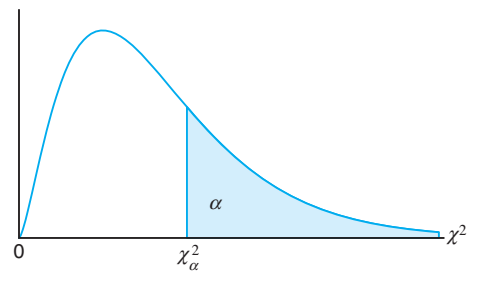
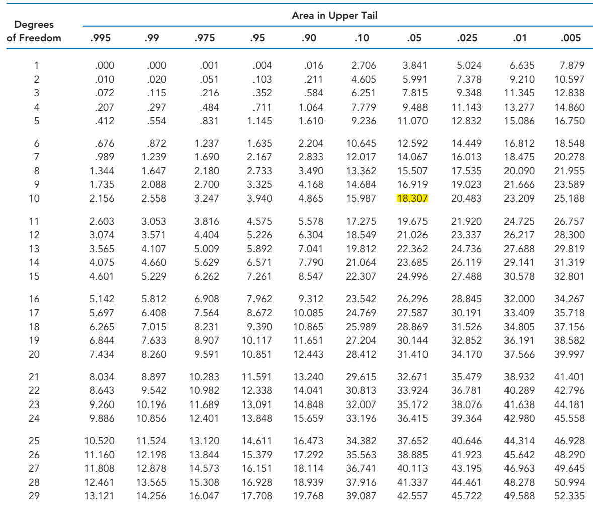
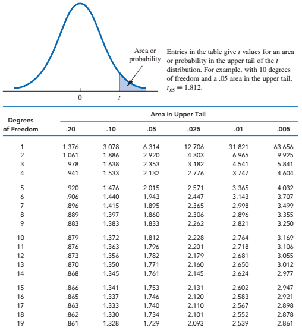

# Sampling and Sampling distributions

## Some preliminary idea [@anderson2020]

- An **element** is the entry on which data are collected.

- A **population** is the collection of all the elements of interest.

- A **sample** is a subset of the population.

- A **sampling frame** is the ***list*** of all the elements in the population of interest.

- A numerical measure (e.g., mean, median, standard deviation, proportion) computed from population is referred as **population parameter**.

- A numerical measure (e.g., mean, median, standard deviation, proportion) computed from sample is referred as **sample statistic**.

## **Sampling from a Finite Population**

### **Simple random sample (Finite population)**

A **simple random sample (SRS)** of size $n$ from a *finite* population of size $N$ is a sample selected such that each possible sample of size $n$ has the same probability of being selected.

- Sampling can be *with* replacement (**SWR**).

- Sampling can be *without* replacement **(SWOR)**.

- In both case, the probability of a particular element being selected in $n/N$.

## **Sampling from an Infinite Population**

In the case of infinite population, it is not possible to develop a sampling from. In that case statisticians recommend selecting a random sample

### Random sample (Infinite population)

A **random sample** of size $n$ from an *infinite* *population* is a sample selected such that the following conditions are satisfied.

1\. Each element selected comes from the same population.

2\. Each element is selected independently.

::: callout-note
## Notes and Comments

1\) A sample selected randomly from a population (finite or infinite) is referred as a *random sample.* The procedure of selecting a sample randomly is known as *probability sampling.*

2\) The *number* of ways simple random samples by **SWR** of size $n$ that can be selected from a finite population of size $N$ is

$$N^n$$

3\) The *number* of ways **different** simple random samples by **SWOR** of size $n$ that can be selected from a finite population of size $N$ is

$${N \choose{n}}=\frac{N!}{n!(N-n)!}$$

4\) Some other probability sampling methods are *stratified random sampling, cluster sampling,* and *systematic sampling*. We will discuss these methods later.

5\) We use the term “simple” in simple random sampling to clarify that this is the probability sampling method that assures each sample of size $n$ has the same probability of being selected.
:::

### Selecting simple random sample using R

Suppose we have a variable $X$ and let it contains $N=4$ elements as follows:

$X=\{3,5,7,9\}$

Using `R` we can draw several simple random samples of size $n=2$.

Now we draw a random sample (by using both SWR and SWOR )using `sample()` function in base `R`.

**Sampling without replacement (SWOR)**

```{r echo=TRUE}
set.seed(2103) # To keep reproducibility
X=c(3,5,7,9) # The elemnets in X variable

# Drawing a random sample without replacement
sample(X,2, replace = FALSE)

```

The all possible that is ${N\choose n}={4\choose 2}=6$ samples (by *SWOR*) are :

```{r echo=FALSE}
samples_swor<-combn(X,2)
#class(samples)
colnames(samples_swor)<-c("Sample1","Sample2","Sample3","Sample4","Sample5","Sample6")
#t(samples_swor)

```

| Sample \# | Sample | Probability |
|:---------:|:------:|:-----------:|
|     1     |  3,5   |     1/6     |
|     2     |  3,7   |     1/6     |
|     3     |  3,9   |     1/6     |
|     4     |  5,7   |     1/6     |
|     5     |  5,9   |     1/6     |
|     6     |  7,9   |     1/6     |

: Samples of size n=2 Without replacement

**Sampling with replacement (SWR)**

The all possible that is $N^n=4^2=16$ samples (by *SWR*) are :

```{r echo=TRUE}
# Drawing a random sample with replacement
sample(X,2, replace = TRUE)
sampls_swr=expand.grid(X, X)
```

| Sample \# | Sample | Probability |
|:---------:|:------:|:-----------:|
|     1     |  3,3   |    1/16     |
|     2     |  3,5   |    1/16     |
|     3     |  3,7   |    1/16     |
|     4     |  3,9   |    1/16     |
|     5     |  5,3   |    1/16     |
|     6     |  5,5   |    1/16     |
|     7     |  5,7   |    1/16     |
|     8     |  5,9   |    1/16     |
|     9     |  7,3   |    1/16     |
|    10     |  7,5   |    1/16     |
|    11     |  7,7   |    1/16     |
|    12     |  7,9   |    1/16     |
|    13     |  9,3   |             |
|    14     |  9,5   |    1/16     |
|    15     |  9,7   |    1/16     |
|    16     |  9,9   |    1/16     |

: Samples of size n=2 with replacement

## Sampling distribution

The probability distribution of a **sample statistic** is called a **sampling distribution.**

For example, due to sampling variability the **sample mean** $\bar X$ has a sampling distribution.

**Illustration** Consider a population of variable X: 1,3,5,7,9.

**Task-1: Compute** population mean $\mu$ .

[Solution:]{.underline}

Here, $\mu=\frac{\sum x}{N}=\frac{1+3+...+9}{5}=5$

**Task-2:** **Draw** all possible samples (without replacement) of size $n=2$ from this population. Then compute the means of all samples.

```{r echo=FALSE}
all_sampl<-combn(X,2)
#class(all_sampl)
#colnames(samples)<-c("Sample1","Sample2","Sample3","Sample4","Sample5","Sample6","Sample7","Sample8","Sample9","Sample10")
#t(all_sampl)
#rowMeans(t(all_sampl))
```

[Solution:]{.underline}

|            |                           |
|:----------:|:-------------------------:|
| **Sample** | **Sample mean,** $\bar x$ |
|    1,3     |             2             |
|    1,5     |             3             |
|    1,7     |             4             |
|    1,9     |             5             |
|    3,5     |             4             |
|    3,7     |             5             |
|    3,9     |             6             |
|    5,7     |             6             |
|    5,9     |             7             |
|    7,9     |             8             |

: All Samples of Size 2 and Their Means

**Task-3:** **Construct** a probability distribution of sample means, $\bar X$ (discrete) and **plot** it.

[Solution:]{.underline}

| $\bar x$ |  $f(\bar x)$   |
|:--------:|:--------------:|
|    2     | $\frac{1}{10}$ |
|    3     | $\frac{1}{10}$ |
|    4     | $\frac{2}{10}$ |
|    5     | $\frac{2}{10}$ |
|    6     | $\frac{2}{10}$ |
|    7     | $\frac{1}{10}$ |
|    8     | $\frac{1}{10}$ |

: Sampling distribution of $\bar x$

```{r}
#| label: fig-samdist
#| fig-cap: "Sampling distribution of $\\bar{x}$"

Y<-seq(1,9,2)
all_sampl<-combn(Y,2)
#class(all_sampl)
#colnames(all_sampl)<-c("Sample1","Sample2","Sample3","Sample4","Sample5","Sample6","Sample7","Sample8","Sample9","Sample10","Sample11","Sample12","Sample13","Sample14","Sample15")
#t(all_sampl)
#rowMeans(t(all_sampl))

#barplot(table(rowMeans(t(all_sampl))))

sam_dist<-data.frame(x_bar=2:8,f=c(1,1,2,2,2,1,1))
library(tidyverse)
sam_dist %>% mutate(px_bar=f/sum(f)) %>% ggplot(aes(x=x_bar,y=px_bar))+
  geom_col(fill="gray20",width = 0.9)+
  labs(x=expression(bar(x)),y=expression(f(bar(x))))+
  theme_bw()+
  theme(axis.title = element_text(face = "bold"))
```

**Task-4:** **Find** the $E(\bar X)$ . Does $E(\bar X)$ same as population mean $\mu$?

[Solution:]{.underline}

$E(\bar X)=\sum \bar x \cdot f(\bar x)$

$=2(1/10)+3(1/10)+4(2/10)+\cdot \cdot \cdot+8(1/10)=5$

We can see that $E(\bar X) =5$ is same as $\mu=5$.

**NOTE:** This phenomenon is known as the **unbiasedness** of a sample statistic or an estimator. We will discuss it briefly in next chapter.

**Home work:** Consider a population of variable X: 3,6,9,12,15.

i\) **Compute** population mean $\mu$ .

ii\) **Draw** all possible samples of size $n=3$ from this population without replacement. Then compute the means of all samples.

iii\) **Construct** a probability distribution of sample mean, $\bar x$ (discrete) and **plot** it.

iv\) **Find** the $E(\bar X)$ . Does $E(\bar X)$ same as population mean $\mu$?

## Sampling distribution of $\bar X$

The sampling distribution of $\bar X$ is the probability distribution of all possible values of the sample mean $\bar X$.\

- Expected value of $\bar X$:

$$E(\bar X)=\mu_{\bar X}=\mu$$

- Standard deviation of $\bar X$ :

  **CASE I:** Sampling without replacement **(SWR)** or if $N$ is **infinite** (or finite but $\frac{n}{N}\le 0.05$)

  $$\sigma_{\bar X}=\frac{\sigma}{\sqrt n}$$

  **CASE II:** Sampling without replacement **(SWOR)** and $N$ is **finite**:

$$\sigma_{\bar X}=\frac{\sigma}{\sqrt n}\sqrt{\frac{N-n}{N-1}}$$

Standard deviation of $\bar X$ is also known as **Standard error of** $\bar X$ or $s.e(\bar X)$.

**But** what is the **form** of the sampling distribution of $\bar X$?

### Central limit theorem (CLT)

The sampling distribution of the mean of a random sample drawn from any population is approximately normal for a sufficiently large sample size. The larger the sample size, the more closely the sampling distribution of $\bar X$ will resemble a normal distribution.

::: callout-note
## The Central Limit Theorem

Let, $X_1$,$X_2$, .... be a sequence of independently and identically distributed random variables with common mean $\mu$ and common variance $\sigma^2$. We define

$$Z=\frac{\bar X -\mu_{\bar X}}{\sigma_{\bar X}}$$

Then the $Z$ will be approximately normally distributed as the sample size $n \rightarrow\infty$.
:::

The definition of "sufficiently large" depends on the extent of non-normality of $X$ . Some authors consider a sample will be sufficiently large if $n\ge30$ [@walpole2017].

### Central Limit Theorem through simulation

In this section we illustrates how sampling distributions of sample means approximate to normal or bell shaped distribution as we increase the sample size .

**At first,** we consider a population data regarding `gdp per capita (USD),2023` of 218 countries. We can see that the distribution of `gdp per capita` is highly skewed to the right (see @fig-fig_clt1).

```{r}
#| label: fig-fig_clt1
#| fig-cap: "Frequency histogram of GDP percapita of N=218 countries"

library(readxl)

GDP_percap23 <- read_excel("StatForBandE_data.xlsx", 
    sheet = "GDP_percap23")
#View(GDP_percap23)
library(tidyverse)
library(scales)


#GDP_percap23 %>% select(`Country Name`,Y_2023) %>%arrange(-Y_2023)

GDP_percap23 %>% select(`Country Name`,Y_2023) %>%
  filter(`Country Name`!="Monaco") %>% 
  drop_na()->gdp_2023

#gdp_2023 %>% summarise(mu=mean(Y_2023), sigma=sd(Y_2023)) %>% 
#  knitr::kable(digits = 2)

gdp_2023%>%
  ggplot(aes(x=Y_2023))+
  geom_histogram(col="black",fill="lightblue",bins = 10)+
  scale_x_continuous(labels = comma)+
  labs(x="GDP per capita (USD)",y="Number of countries",
       caption="Source: World Bank, 2023")+
  theme_bw()+
  theme(plot.caption =element_text(face = "italic",size = 12))+
  annotate("text", x=100000,y=75, 
           label = expression(~mu == 19575.12),
           color = "black", size = 4)+
  annotate("text", x=100000,y=70, 
           label = expression( ~ sigma == 25324.77),
           color = "black", size = 4)+
  annotate("rect",xmin = 83000, xmax = 119500, ymin = 65, ymax = 80, 
           alpha = 0.2, fill = "lightblue")


```

**Now** we draw 1000 random samples (without replacement) of different sample sizes and then plot the histogram of samples means.

```{r}
#| label: fig-cltsim
#| fig-cap: "Demonstration of Central Limit Theorem through simulation"
#| fig-subcap: 
#|   - "Sampling distribution of sample mean for sample size n=10"
#|   - "Sampling distribution of sample mean for sample size n=30"
#|   - "Sampling distribution of sample mean for sample size n=100"
#| layout-ncol: 3


xgdp<-gdp_2023$Y_2023
nsim=1000 # no of simulations/ samples

set.seed(231)

replicate(nsim,sample(xgdp,10)) %>%colMeans() %>%as.data.frame() %>% ggplot(aes(x=.))+
  geom_histogram(bins = 10,fill="steelblue1",col="black")+
  theme_bw()->pclt_1

  

replicate(nsim,sample(xgdp,30)) %>%colMeans() %>%as.data.frame() %>% ggplot(aes(x=.))+
  geom_histogram(bins = 10,fill="steelblue2",col="black")+
  theme_bw()->pclt_2
  

replicate(nsim,sample(xgdp,100)) %>%colMeans() %>%as.data.frame() %>% ggplot(aes(x=.))+
  geom_histogram(bins = 10,fill="steelblue3",col="black")+
  theme_bw()->pclt_3

pclt_1
pclt_2
pclt_3

```

From @fig-cltsim we can see that as the sample size increases, the sampling distribution of **sample mean** tends to bell-shaped or normal though the population data was very skewed to the right. This simulation clearly demonstrate the fact of Central Limit Theorem (CLT).

For more interactive simulation of **CLT** please [click here to visit the ShinyApp for Central Limit Theorem Simulation](https://saifuddin24.shinyapps.io/CLT_Sim/).

**Problem 8.1** The foreman of a bottling plant has observed that the amount of soda in each 32-ounce bottle is actually a normally distributed random variable, with a mean of 32.2 ounces and a standard deviation of .3 ounce [@keller2014, page 308].

a\. If a customer buys one bottle, what is the probability that the bottle will contain more than 32 ounces?

b\. If a customer buys a carton of four bottles, what is the probability that the mean amount of the four bottles will be greater than 32 ounces?\

**Problem 8.2** Suppose a subdivision on the southwest side of Denver, Colorado, contains 2215 houses. The subdivision was built in 1983. A sample of 100 houses is selected randomly and evaluated by an appraiser. If the mean appraised value of a house in this subdivision for all houses is \$177,000, with a standard deviation of \$8,500, what is the probability that the sample average is greater than \$185,000? [@black2012, page 243 (population size is changed)]\

**Problem 8.3** A scientist is studying the heights of men in Australia. The true population mean $\mu$ is unknown but the true population standard deviation is assumed to be 2.5 inches. Suppose the scientist randomly samples 100 men. **Find** the probability that the difference between the sample mean and the true population mean is less than 0.5 inches.

**Problem 8.4** In rainy season, it tends to rain a lot in Dhaka. Suppose that the amount of rain that falls on any given winter day in Dhaka is normally distributed with a mean of $2.3 mm$ and a variance of $1.21 \ \ mm^2$. Assume rainfalls are independent from day to day.\
\
(a) **Find** the probability that between 1.9 and 3.4 mm of rain fell today.

\(b\) **Find** the probability that the total amount of rain that falls over the next 20 days is between 54.3 and 57.1 mm.

**Problem 8.5** Suppose, we load on a plane 100 packages whose weights are independent random variables that are uniformly distributed between 5 and 50 pounds. What is the probability that the total weight will exceed 3000 pounds?\

## Sampling distribution of sample proportion, $\hat p$

The sample proportion $\hat p$ is the point estimator of the population proportion $p$. The formula for computing the sample proportion is

$$\hat p=\frac {x}{n}$$ Where,

$x=$ number of *successes* in the sample of size $n$.

**Case-I (small sample):** If $X\sim Bin(n,p)$ then $\hat p$ also follows **binomial distribution** with

$$Mean: E(\hat p)=p$$

$$Variance: \sigma^2_{\hat p}=\frac{p(1-p)}{n}$$\

**Case-II (large sample):** When the sample size is large enough so that $np$ and $n(1-p)$ are greater than or equal to $5$ then $\hat p$ will be approximately normally distributed with

$$ Mean: E(\hat p)=p $$

$$ Variance: \sigma^2_{\hat p}=\frac{p(1-p)}{n} $$

**Problem 8.6** According to the Internal Revenue Service, 75% of all tax returns lead to a refund. A random sample of 100 tax returns is taken.

a.  What is the mean of the distribution of the sample proportion of returns leading to refunds?
b.  What is the variance of the sample proportion?
c.  What is the standard error of the sample proportion?
d.  What is the probability that the sample proportion exceeds 0.8?

**Problem 8.7** A random sample of 270 homes was taken from a large population of older homes to estimate the proportion of homes with unsafe wiring. If, in fact, 20% of the homes have unsafe wiring, what is the probability that the sample proportion will be between 16% and 24%?

## Sampling Distribution of the Sample Variances

Like as sample mean, **sample variance** is also considered as a random variable due to sampling variability.

If we have a random sample $\{X_1,X_2, . . . , X_n\}$ of size $n$ then the quantity

$$S^2=\frac{1}{n-1} \sum_{i=1}^n (X_i-\bar X)^2 $$

is called the **sample variance**.

::: callout-note
## Sampling Distribution of the Sample Variances

If $S^2$ is the variance of a random sample of size $n$ taken from a normal population having the variance $\sigma^2$, then the statistic

$$\chi^2=\frac{(n-1)S^2}{\sigma^2}=\frac{\sum_{i=1}^n (X_i-\bar X)^2}{\sigma^2}$$

has a **Chi-squared distribution** with $\nu =n-1$ degrees of freedom.
:::

**Mean of** $S^2$: $E(S^2)=\sigma^2$

**Variance of** $S^2$**:** $Var(S^2)=\frac{2\sigma^4}{(n-1)}$

**How to to determine the area under the curve of** $\chi^2$ **distribution?**

In every statistics textbook area under the $\chi^2$ distribution can be determined for a given **degrees of freedom.** The distribution is defined for only positive values, since variances are all positive values. For a given probability or area say $\alpha$ and degrees of freedom $\nu$ we can determine the value of $\chi^2$ to the upper tail such that:

$$P(\chi^2>\chi^2_{\alpha})=\alpha$$

{#fig-chi.squared width="372"}

For example, when $\alpha=0.05$ and $\nu=10$ the value of $\chi^2_{\alpha}$ is $18.307$.

{#fig-chisqtab width="558"}

**Problem 8.8** A random sample of size $n = 18$ is obtained from a normally distributed population with a population mean of $\mu = 46$ and a variance of $\sigma^2 = 50$.

a.  What is the probability that the sample mean is greater than 50?

b.  What is the value of the sample variance such that 5% of the sample variances would be less than this value?

c.  What is the value of the sample variance such that 5% of the sample variances would be greater than this value?

**Problem 8.9** A process produces batches of a chemical whose impurity concentrations follow a normal distribution with a variance of 1.75. A random sample of 20 of these batches is chosen. Find the probability that the sample variance exceeds 3.10.

[Solution:]{.underline}

Let, $X$ be the impurity concentration

Given, $\sigma^2=1.75$; $n=20$ . We have to compute

$$P[s^2>3.10]=P\left[  \frac{(n-1)s^2}{\sigma^2}>\frac{(20-1)(3.10)}{1.75} \right ]$$

$$=P\left[ \chi^2>33.657 \right]\approx 0.01$$

So there is approximately 1% chance that the sample variance exceeds 3.10.

## *t*-Distribution

Let $Z\sim N(0,1)$ and $V\sim \chi^2 _\nu$ . If $Z$ and $V$ are independent then the random variable

$$T=\frac{Z}{\sqrt {V/\nu}}$$

said to have a *Student-t distribution with* $\nu$ *degrees of freedom.* The PDF of $T$ is

$$f(t)=\frac{\Gamma [(\nu+1)/2]}{\sqrt{ \pi\nu} \ \ \Gamma{(\nu/2)}}\left(1+\frac{t^2}{\nu}\right)^{-(\nu+1)/2} ; -\infty<t<\infty.$$

::: callout-note
## Theorem

Given a random sample of $n$ observations, with sample mean $\bar X$ and sample standard deviation $S$, from a normally distributed population with mean $\mu$, the random variable $T$ follows the *Student’s t distribution* with $\nu=(n - 1)$ degrees of freedom and is given by

$$T=\frac{\bar X-\mu}{S/\sqrt n}$$
:::

**Properties:**

1)  Symmetry: $t$-distribution is symmetric about mean (zero). So

    if $P(T>t_\nu)=\alpha$ then $P(T<-t_\nu)=\alpha$.

2)  Convergence to Normal: As $n\rightarrow\infty$ then the distribution of $T_\nu$ approaches the standard Normal distribution.

3)  Cauchy as special case: The $T_1$ distribution is the same as the Cauchy distribution.

**How to to determine the area under the curve of** $t$- **distribution?**

From $t$ -distribution table we can determine the value of $t$ for a given $area$ and *degrees of freedom.*

For example, with $n=11$ and area in upper tail 0.05 the the value of $t$ is $1.812$. That is

$$P(T>1.812)=0.05 $$

Due to symmetry

$$P(T<-1.812)=0.05$$



## *F*-Distribution

### The *F* -Distribution with Two Sample Variances

If $S_1^2$ and $S_2^2$ are the variances of independent random samples of size $n_1$ and $n_2$ taken from normal populations with variances $\sigma_1^2$ and $\sigma_2^2$, respectively, then the random variable

$$F=\frac{S_1^2/\sigma_1^2}{S_2^2/\sigma_2^2}$$

has an $F$ distribution with numerator degrees of freedom $(n_1-1)$ and denominator degrees of freedom $(n_2-1)$.

## Other Sampling methods

### Probability sampling

**Stratified Random Sampling**

**Cluster Sampling**

**Systematic Sampling**

### Non-probability sampling
